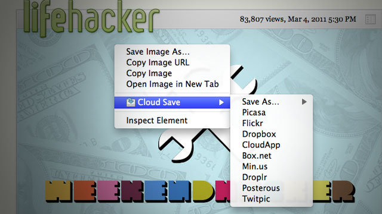

&nbsp;

I didn't really want to write a post about yet another chrome extension, as the last five posts have somehow or another related to Google Chrome. Actually, the post I was planning to write before this was "Why the Chrome Webstore is broken", which would be sort of less fanboy-ish. Anyway, this extension is rather simple, so I'll probably go into the reasoning as to why I made it, where it might be headed and how I made it. There probably won't be too much interesting information here.

I wanted a Cr-48\. Why? I'm not sure, partially because I don't actually have a laptop of my own, though my brother's Macbook Pro (which I'm typing this post on) is pretty awesome. Plus, the platform is new, non-intimidating, more or less open, and there's such a lack of the most basic tools, that I could probably get a few twitter followers by creating web apps which did things that are really basic yet somehow the web is lacking with. Things like an offline dictionary or wikipedia dump reader. So, Chrome OS seemed cool, and probably guaranteed bragging rights, at least more so than a Google TV probably would. Due partially to my age, I'm pretty scared of using money and have this feeling that I shouldn't spend anything on anything more than a can of soda. I guess I've gotten off-topic enough, and so, I wanted a Cr-48 (for free, of course).

In my opinion, Google's pretty good at copying Apple. I don't mean that in a bad way. I wouldn't say it's the intention, but at least they can recognize a good feature and can copy the essence of it in a pretty functional way while for the most part, distancing from the less good parts. Unlike my feelings of what Microsoft would do, which would be to copy most of the bad parts wholesale and add some pretty fascinating and novel parts. So, if any company were to give me a free laptop, that would be awesome, but Apple certainly isn't going to give things away, and Google's the only company I think can properly copy the trackpad (though it appears they can't even do that, from what I've read).

So, that's probably random enough, and you're wondering how this relates to anything at all. Well, part of my quest to attain a Cr-48 involved building some pretty interesting pieces of software targeted at chrome os (but not by any means exclusive to chrome os). This included the offline dictionary and wikipedia reader. That way, if I didn't get a Cr-48, I could have an excuse to hate Google and I might be less frequently arguing in their support. But this backup plan failed (fortunately), and I won the LucidChart Cr-48 competition by drawing a picture of a Cr48 out of flow chart components.

I started using Google Groups because I could. I wasn't spammed by google in the great spamming of some time in february, which means Google hadn't magically picked for me to have one of those devices (I think this was before I won the LucidChart competition). So I later joined the non-involuntary group for chrome notebook pilots so I could eagerly await the knock on my door from UPS and be prepared for what to do when that happened.

I skimmed through tons of random posts and eventually I noticed a pattern. People hated the file system and wanted a way to basically get rid of it. The irony is that this new Cloud that is being created, is a static collection of walled gardens. So much for progress. There's no standard for interoperability and it hasn't really been too important, but somehow, because of Chrome OS's probably bad file system, people are recognizing that that this isn't right to have an intermediary step to get data from one application to another.

I've always held that Browsers are to improve the user experience as much as possible while keeping all of the internet on a balanced and equal platform. I felt that Extensions were the means to trigger change to a specific group of websites or a general heuristic in order to make a more perfect experience. I thought of that while making drag2up, which creates a novel and useful feature which should be used by everybody. As part of building it, I ended up with a sort of OCD toward creating an implementation of every imaginable file host.

Cloud Save's heritage is probably as much owed to drag2up as it is to Clip It Good, the latter of which I've never actually used, but found it inspiring nonetheless (and I ripped the Picasa implementation out of it too). Clip It Good was the general idea for Cloud Save, except that Cloud Save had more hosts. I made Cloud Save in thirty one minutes and thirty nine seconds, give or take a minute or so. The fact it was made in a mere half hour shows how the idea isn't novel at all. In fact, most of those minutes were spent setting up the directory structure, manifest, installing inkscape, downloading the tango icon set and unzipping the icons to steal the save action icon (much like how I stole the up arrow icon used as drag2up's logo). Nearly all of Cloud Save was the code needed to create the context menu. The downloading from URL, authentication and upload stuff was already in drag2up (I myself was pretty impressed about this. Evidently, I forgot how many features I had put into drag2up.).

Cloud Save wasn't meant as a sort of glorified bookmark system. Or as a means to politely reshare images without hotlinking. I thought the need was to bypass the physical filesystem. That's why the application is target primarily toward services which provide a virtual file system: a directory structure, files, privacy, etc. It wasn't ever really intended as a means to share files, but I guess this is what people want it to do, so I'll probably make the extension more sharing oriented in the future.

I realized I just forgot the rest of what I was about to write about, so I guess I'll end it rather abruptly here. This morning, at 11 AM (though I don't know if this date has been adjusted for my time zone) when I was still probably in school, Lifehacker posted about it and now people are using it. Awesome. I didn't expect this to be that significant.
