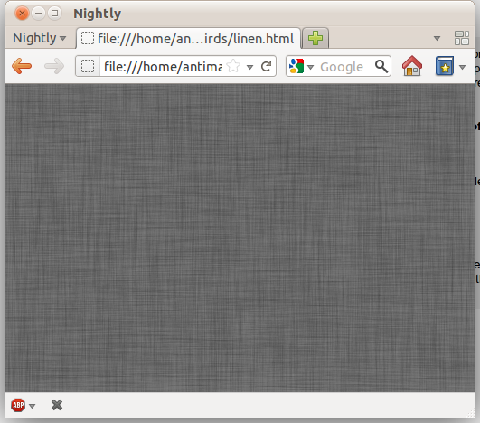

I guess the linen texture which is way too prevalent in Lion and iOS 5 looked pretty cool so I tried replicating the effect in canvas. It's not instant but the texture is generated fairly quickly. It's all done in around 20 lines of code. The basic idea is to first create a bunch of semi-transparent noise such as the stuff on the right (Though in the real one the opacity is only 3% and in the one on the right it's been increased to 70%). To do that, we createImageData and set every fourth pixel to 6 if Math.random() &lt; 0.1\. That means approximately 10% of the canvas will be semi-transparent with the rest being totally transparent. I'm not clever enough to embed some steganographic message in the ostensible noise pattern, because I'm just way too lazy for that sort of stuff. But if you think that that last sentence was actually a decoy for my master plan, feel free to waste time decoding a message which probably isn't there.

After that, the canvas is converted to a DataURL so it can be loaded as an image. After loading the image, we iterate 40 times and call drawImage on the original canvas with an offset to make every single point into a cross-shape. [Demo](http://antimatter15.com/misc/linen.html).
