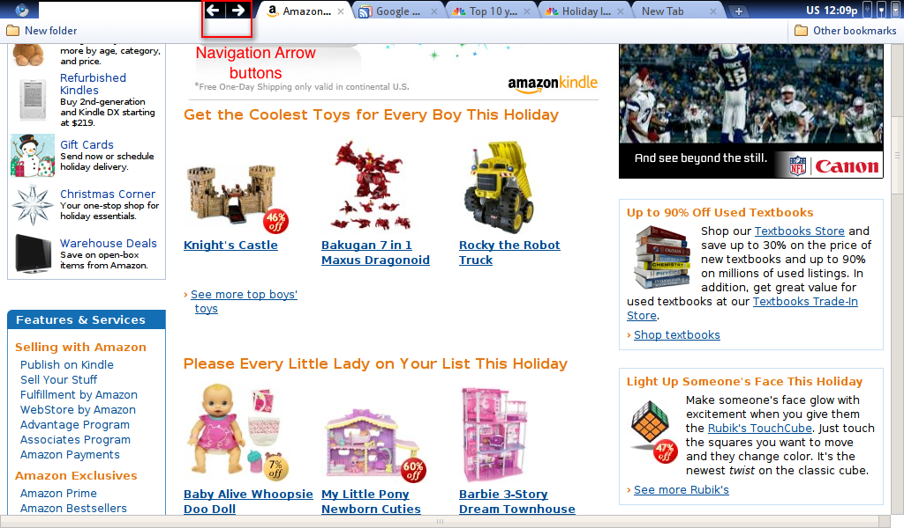
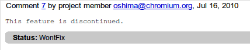
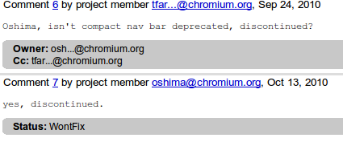

I saw [this article ](http://code.google.com/p/chromium-os/issues/detail?id=3220&amp;can=1&amp;q=compact%20nav%20bar&amp;colspec=ID%20Stars%20Pri%20Area%20Type%20Status%20Summary%20Modified%20Owner%20Mstone)on hacker news and slashdot recently about how Google might remove the URL bar from future versions of Chrome. It's almost definitely not true.

First off, [the images are about Chrome OS](http://dev.chromium.org/chromium-os/user-experience/window-ui). Not Chrome. The page doesn't signal any intent to change the behavior of "Chromium-based browsers". Side tabs and the contact nav bar make sense on Chrome OS because netbooks such as those Chrome OS is targeting tend to be really wide with very little vertical space. There's also generally not much RAM so having lots of tabs isn't practical.

The compact nav bar as it was known existed in builds of Chrome OS from late 2009 (when it was open sourced) and 2010\. But it's [been discontinued](http://code.google.com/p/chromium/issues/detail?id=37979#c9) and the page hasn't been updated for almost a year.

A quick search on the chromium bug tracker for the[ compact nav bar](http://code.google.com/p/chromium/issues/list?can=1&amp;q=compact+nav+bar&amp;colspec=ID+Stars+Pri+Area+Feature+Type+Status+Summary+Modified+Owner+Mstone+OS&amp;cells=tiles) shows that nearly all the bugs related to it have been marked WontFix. It's been discontinued for over 7 months.

And please follow me on [twitter](http://twitter.com/antimatter15).
