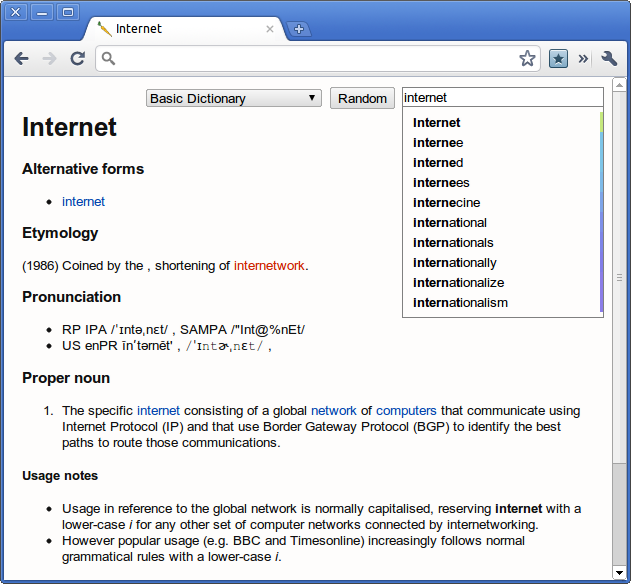
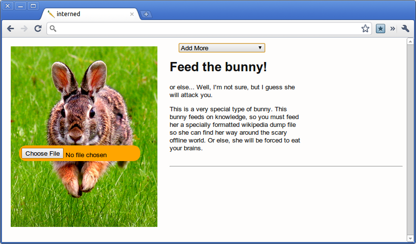

[")](http://www.lucidchart.com/community/examples/view/4d40ad1f-f1b0-44a7-b39b-1db00ac17bf0)

So, lets begin with a plead for you to [rate my submission (ideally favorably)](http://www.lucidchart.com/community/examples/view/4d40ad1f-f1b0-44a7-b39b-1db00ac17bf0) for the LucidChart chrome notebook contest, partly because it would be awesome, and I need to test the aforementioned HTML5 offline Wikipedia dump reader.

Wikipedia is awesome, and on my service-less iPhone 2G, one of the most useful apps is one with an outdated (by something like three years) Wikipedia dump reader. There's something very [much like the Hitchhiker's Guide ](http://xkcd.com/548/)in carrying the "sum of all human knowledge" in one's pocket. Wikipedia grows really quickly and the English language dump (as of last month at time of writing) is over six gigs of bzipped XML.

Another reason for building an offline Wikipedia dump reader is simply that I can. There's a lot of cool and cutting edge stuff in this. It uses the file input JS API, FileReader, Blobs, WebWorkers, fast Javascript to handle a pure-JS implementation of the LZMA compression algorithm, and the FileSystem API.

All this stuff has only been possible for a very short amount of time. In fact, the FileSystem API only arrived with the release of Chrome 9 today. It's pretty awesome to imagine that a web page, HTML and Javascript is processing multiple gigabytes of data at real time. At the current unoptimized state, the search results and the article shows up instantly within 100ms of a key press event (However, I admit it has yet to be tested on the actual English Wikipedia).

This app is almost ideally suited for Chrome OS. A hundred megabytes worth of data in a month (with the Verizon deal, not to mention that it's limited to two years) isn't very much and it would be a pity for the sixteen gigabytes of SSD space on a Cr-48 to be wasted. One of the dumps that I've compiled is a subset of the English Wiktionary which makes a great lightweight (8MB) dictionary with over sixty five thousand words. Wiktionary is fairly large at 217MB, and the Simple English Wikipedia is 51MB.

Assuming you can somehow access the dumps, I probably won't post them on this server because of the massive bandwidth usage, someone else could, the process for using it is very simple. Download the file to your  computer through HTTP, a torrent, or create it yourself. You might have noticed that the favicon is a picture of a carrot because that's the current codename. Well, not really a codename, but I was scrolling through some icon lists and saw one for a carrot on the first page. I don't even like carrots, but I digress. The dump uploading screen has a picture of a bunny biting a file upload carrot that you click on to select the file. Select the file, and it automagically copies it over to a persistent folder. Then you're off to searching and reading articles and definitions :)

I'm not done yet, or at least, I don't feel like packaging it up and submitting it to the chrome webstore yet because I need to figure out a good way to host database dumps.
