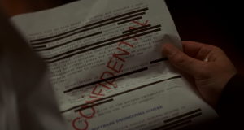

This post is going to be nothing like any other post, because it's going to be about the video frame at the 650th second of the movie Inception.

With a bit of [Googling](http://www.google.com/search?hl=en&amp;q=%22the%20changes%20in%20photoluminescence%20of%20arrays%20of%22&amp), it seems the first part of this document is "Development of Highly Sensitive Portable Hydrocarbon Sensors" by  [Dr. Michael Carpenter](http://www.utrc2.org/directory/people.php?viewid=70) at the [State University of New York](http://www.utrc2.org/directory/partners.php?viewid=27).

Here follows the text of the document taken from http://www.utrc2.org/research/projects.php?viewid=155 marked up to correspond with the appearance of the document in Inception. The second part of the document in the frame does not appear to be from the same source and I've encountered difficulty in locating the source of that part of the document. The visible differences between the source document and the image from Inception are in bold while the redacted contents are in strikeout. The newlines are approximately where they are in the visible document.
> January 2007 we have begun to develop and evaluate a cost
>
> and space effective sensing assembly which will leverage our
>
> <del>past and future hydrocarbon sensor development efforts funded </del>
>
> <del>by the NYS-DOT. The UTRC funded program is developing and </del>
>
> <del>evaluating the proof of concept</del> for a portable and cost effective
>
> <del>hydrocarbon sensor based on a compact optical</del> spectrometer which
>
> monitors the changes in photoluminescence of arrays of
>
> hydrocarbon sensitive quantum dots (QDs).<del> Through this </del>
>
> <del>program </del><del>we have recently demonstrated the ability to detect </del>
>
> <del>xylenes at 50ppm concentration levels. While this is a very</del>
>
> promising result given the cost effective hardware that is
>
> being used in this program, this detection limit needs to
>
> be reduced to 100pp**b** levels for this device to have a range
>
> of environmental applications. Therefore, we propose to
>
> expand this program to include the following new
>
> initiatives **during the 2007-08 program**:
>
> 1)Investigation of QD based materials with <del>ppb level </del>
>
> <del>sensitivity through the use of resonant</del> energy
>
> transfer sensing mechanisms,
>
> 2)Deposition of QD arrays to increase the sensing
>
> dynamic range to ppb to % level concentrations,
>
> <del>3)Optimization of 6 element arrays for </del>
>
> <del>increased selectivity, and</del>
>
> 4)Implementation of the pattern recognition software
>
> selected during the 2006-07 program.

And so the question is: Is there a specific reason that the secret document was of hydrocarbon detection? What does this have to do with the movie? Is there any significance of the redacted text?
