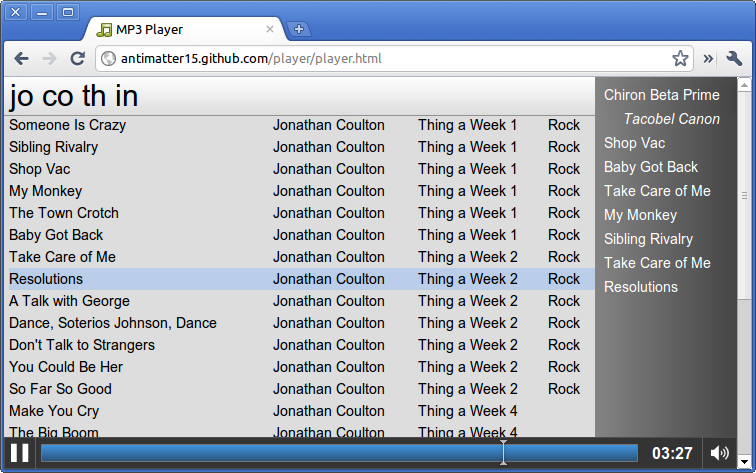

This is my take at an MP3 player. I would consider this one of my better designs (I'm no designer or artist, and that sort of shows). It's fairly minimalistic, a product both of my design and the fact it was created a few hours. But this isn't about design. No, it's a** music player **that operates** entirely in your browser** with files stored on **your hard drive**.

Here's basically how it works. There's an &lt;input type=file webkitdirectory&gt; so you can go and select your music folder. It gets a list of all files, reads the first 128 kilobytes of each mp3 file and parses it for ID3 tags, constructs a library and makes it searchable.

The interface is composed of four main items: a huge search bar, the music library, a playlist and the audio controls. It's pretty self explanatory.

Here it is: [http://antimatter15.github.com/player/player.html](http://antimatter15.github.com/player/player.html)

It should work on Chrome, it might work on Safari, and will partially work on Firefox 4 (No directory select, no MP3). Definitely won't work on IE9 and probably won't work on Opera.
