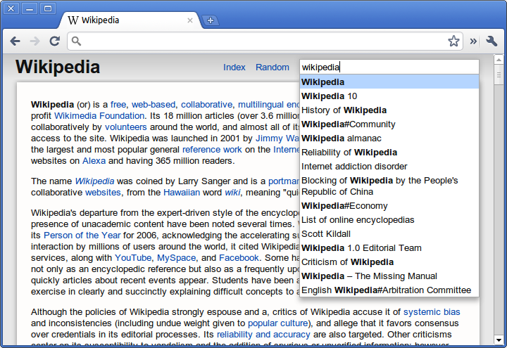

[Offline Wiki for Chrome](https://chrome.google.com/webstore/detail/kchecgcglnoohbdghckmcbefllnibadd?hl=en) is now on the Web Store. The app that started a [few months ago](2011/02/html5-offline-wikipedia-reader-and-help-me-win-a-cr-48/) and took forms as [Offline Dictionary](https://chrome.google.com/webstore/detail/mplnjjdpheipggojikpifkibnoaakkii). The chrome app version is much more refined, aesthetically and functionally. The search bar and autocomplete are much less obtrusive, and there's gradients and box shadows, a sure indication of progress :)

## Description

The most significant difference, is that it includes the** entire English Wikipedia**, a pretty close approximation of the sum of all human knowledge. Uncompressed, it's something like 30 gigabytes of raw text, and the compressed version that I've compiled for this app clocks in at around 3.7 gigabytes (3.4GB for the actual compressed dump and 0.3 for the search index file). Hosting and serving up all those gigabytes does cost money, so that's why the app isn't free. But it's still a pretty good value considering the equivalent apps for iOS are [twice](http://www.brilliantish.com/allofwiki/) [the](http://itunes.apple.com/us/app/wikipedia-offline-for-ipad/id384022310?mt=8) [price](http://itunes.apple.com/us/app/encyclopedia/id288141564?mt=8).

It includes an index which lists every single article in Wikipedia, paginated and navigable through a scroll bar. There are something like 50,000 pages of the index (the exact number depends on the size of your screen), and articles are divided into columns. There's a button which sends you to a random article, and a search bar.

However the notion of this app is pretty strange: A webapp which only serves its function when offline. However, the ease of installation and use of this app is somewhat unparalleled on the desktop space. This app allows the **browsing of the database instantly** after the download has begun, rather than nearly all other such apps which require the entire dump to be downloaded first. There's no conversion process. Everything pretty much hopefully just works.

## HTML5 is awesome.

The interface is done entirely with CSS and HTML, no images except the obligatory [xkcd](http://xkcd.com/214/) reference. The toolbar is a css3 gradient and enclosed with HTML5 tags like &lt;article&gt;, &lt;header&gt; and &lt;footer&gt;. The download progress is indicated by a native &lt;progress&gt; bar element. The index is navigable through a slider bar created using &lt;input type=range&gt; and all the page titles are put automatically into columns by the css3 column layout properties.

The really cool stuff is what's in the javascript. Probably the most significant development which has enabled this app is an awesome thing called the FileSystem API which exposes a special persistent sandboxed read/write directory which can be modified through the File API. When the page is first loaded, the process of downloading begins, and it uses the responseType attribute of the XMLHttpRequest to get the downloaded chunk (it just sets the request header to specify a range of one megabyte) as an array buffer. Array Buffers are a part of the WebGL specification which enables the storage and manipulation of binary data. It then uses BlobBuilder to convert that array buffer into Blob which can then be written using the File API to the hard disk.

To search, it reads a small portion of the index file by using a particular slice of the file, which is the equivalent of seeking on a disk. It implements binary search to quickly locate a certain article on the disk and then reads a chunk from the dump in much the same way. Then it uses a javascript implementation of the LZMA compression algorithm to decode a certain hundred-kilobyte block into raw WikiText which is then parsed into HTML.

Finally, the pushState and replaceState methods from the History API are used to handle the navigation of pages without reloading,.

## Get it now

[Offline Wiki for Chrome](https://chrome.google.com/webstore/detail/kchecgcglnoohbdghckmcbefllnibadd?hl=en)

&nbsp;

&nbsp;

&nbsp;

&nbsp;
