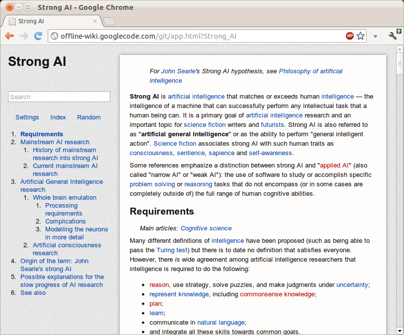

There's just something incredibly alluring about the concept of holding the sum of human knowledge with you at all times. While near-ubiquitous connectivity alleviates this to a certain extent, the momentary lapses of networking are incredibly corrosive to an information dependent mentality. Wikipedia never ceases to amaze me and, while I've tried in the past to encapsulate part of its sheer [awesomeness](https://chrome.google.com/webstore/detail/kchecgcglnoohbdghckmcbefllnibadd?hl=en), this marks a much more significant attempt.

The differences start even before the data gets to the application. The preprocessing toolchain was entirely rewritten for a multitude of reasons. First of all, it compresses not the entireity, but rather the most popular subset of the English Wikipedia. Two dumps are distributed at time of writing, the top 1000 articles and the top 300,000 requiring approximately 10MB and 1GB, respectively. While ostensibly, the mere top 300k articles is far too narrow to delve deep into the long tail, the breadth of the meager 1/25th of articles consistently surprises me in its depth. The advantage is that at 1GB, it's relatively easy to fit into any system. The algorithm which strips extraneous content has been made far more sophisticated than the original series of regular expressions. This enables greater compression and less accidentally omitted content.

On the application end, the application has switched from a [GWT-compiled](https://github.com/nmrugg/LZMA-JS) LZMA SDK to a speedy, [pure javascript decoder](https://github.com/glinscott/lzmajs). This makes page loads significantly speedier and allows greater compression ratios, for individual blocks can be made larger (256KB instead of 100KB). It also now uses WebGL Typed Arrays to further speed things up, such as sending data to and from the WebWorker thread.

The interface was redesigned with CSS media queries to dynamically transition between different modes in response to different viewing environments. The interface consists of two regions: the fixed position recessed left panel which holds the page title, a search bar, controls and the page outline. This collapses down to a toolbar header automatically when the screen estate is limited. It uses an Apple-esque noise texture background.

Downloads happen in little units called chunks (they're half a megabyte for the dump file and about four kilobytes for the index). The local file can be built up out of order. While online, all storage operations check the virtual file, indexed db, or web sql database. If it's not there, it transparently uses an XMLHttpRequest in order to fulfill the request and caches it to disk in the respective persistence mechanism. A bitset is used to keep track of which chunks are already downloaded and which need to be downloaded.

[http://offline-wiki.googlecode.com/git/app.html](http://offline-wiki.googlecode.com/git/app.html)
