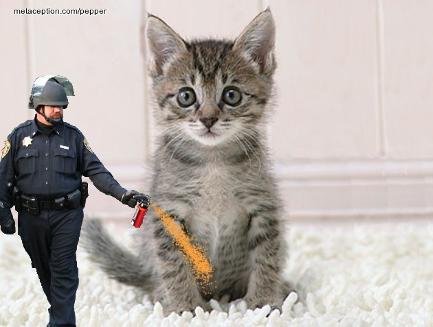

This is a hopefully more entertaining project which piggybacks on a meme which is probably already quite dated relative to the date of the publishing of this article. Nonetheless, that meme and the entire occupy movement will likely hold some place in the annals of internet history. For those unexposed to this meme, UC Davis Police officer Lieutenant John Pike was photographed nonchalantly applying copious quantities of the practical food product (as Fox News phrased it) to the throats and faces of nonviolent protesters.

This app takes a picture and uses the Face.com face detection API in order to locate candidate faces. The image is drawn on canvas with the corresponding cop, and a orange mist is drawn by iteratively drawing random points with accordance to a certain probability distribution. The cop flips with a rather cool animation when you drag him around.  [http://metaception.com/pepper/](http://metaception.com/pepper/)
