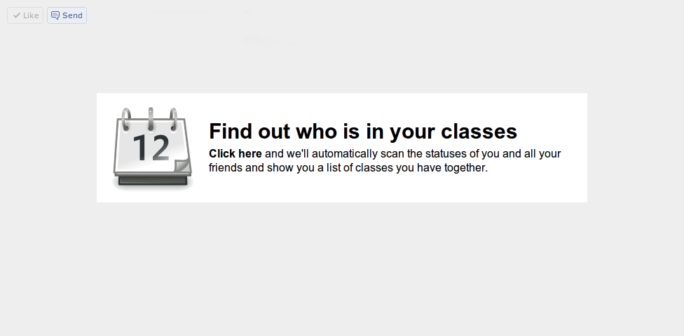

Posting this here is almost certainly useless. I assume very very few people who read this blog tend to be in the target **13-18 year old facebook-using high school student demographic**. By the unlikely chance you are (if you aren't, you can forward this to the nearest person who fits into this demographic, as I will add later, that I'm desperately looking for users).

It's that time of year. The brief window where summer vacation isn't technically over yet as school hasn't started but you still know your classes for next year. You're frantically attempting to complete those long procrastinated summer assignments, or like me, you're desperately trying to avoid them by giving a yourself a false sense of productivity by building random apps.

My first foray into the realm of creating Facebook applications is fairly simple. It compares class schedules. In truth, the reason I made this was probably not the fact that I enjoy making useful tools, but more likely residual bitterness of rejection by a [sci/tech high school](http://tjhsst.edu/) over [three years](2009/01/i-fail/) ago which has a [school-specific](http://jeffsweb.net/scheduler/) schedule comparing app. Nonetheless, a neat side effect of this attempt is that it does happen to be quite cool.

This is also my first published app which is written in the [CoffeeScript](http://jashkenas.github.com/coffee-script/) language. For those of you unaware, CoffeeScript is a language which is syntactically similar to [Python](http://python.org/) but compiles into Javascript. It's not a nasty [GWT](http://code.google.com/webtoolkit/)-esque compilation, but a relatively clean one (barring the underscores that result when you try doing comprehensions and the really cool stuff). I've always meant to write stuff in CoffeeScript, as it has quite a few awesome features. Most importantly is probably the ability to declare a function with two characters (-&gt;) rather than a massive "function(){}" and the array comprehensions.

Compiled (or should I say Transpiled?) languages have odd a few annoying properties, especially with debugging. The biggest issue was probably setting up everything: running a script which uses inotifywait to automatically compile your CoffeeScript once you hit "Save" on your editor of choice (gedit just because it works and comes with Ubuntu). Then when errors happen, your line numbers don't match up and that's also annoying.

The Facebook API is actually pretty good. My app reads Facebook schedules from your friends' statuses. It's not quite as easy as it should be. I could search the user's news feed and that would be trivial except that it only gives me a subset of the statues that I want to be able to process. When using FQL (which I ended up pronouncing Feequel which sounds a bit like Fecal because it's a SQL derivative, even though you're not supposed to pronounce it "sequel") it would only return/search the most recent status. I ended up doing a FQL request for each and every friend that the current user has, which is a on average a pretty big number. Fortunately it doesn't seem like Faecbook has any API limits. Awesome.

For the longest time I was confused because my app inexplicably only worked for me. It turns out that my queries returned blank results for everyone else because I didn't request the right permissions. That's terrible. Absolutely terrible. First of all, the developer shouldn't be entitled to have those magical privileges that the end users can't have. It's insanely confusing. And don't just silently return no results and make the developer question his own sanity.

But it was a permissions issue - a one line fix in the end.

It's also quite depressing that nobody's using it. It's pretty server intensive at the moment and it's running on Google App Engine, which has that new pricing which means I should have my free quota expire after something like a meager 100 users. But I haven't really come close to that. Why? I guess I have little influence over friends.

[http://schedule-compare.appspot.com/](http://schedule-compare.appspot.com/)
