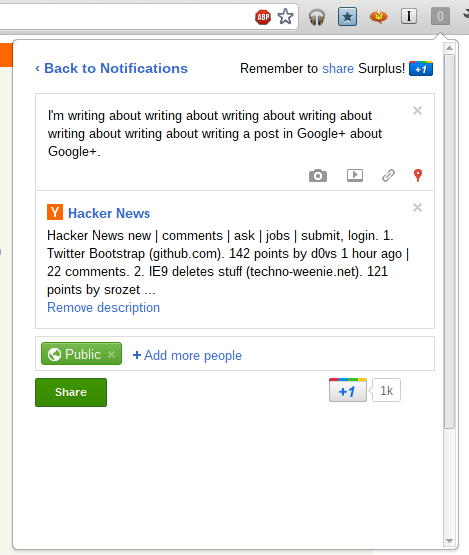
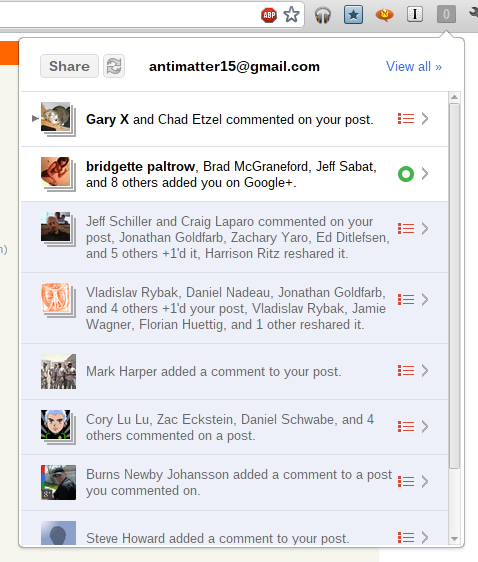

In a continuation of my rather unhelpful habit of documenting my activities on this blog long after you probably already know about it, I guess it's time for me to discuss [Surplus](https://chrome.google.com/webstore/detail/pfphgaimeghgekhncbkfblhdhfaiaipf), my wildly popular (at time of writing) chrome extension which integrates Google+ notifications into Chrome.

Even more impressive, the name, which is a fairly common word is actually on the first page of a Google search for the word (around eighth result). It peaked at around 53,000 users and at one point made me the 329th most followed person on Google+.

&nbsp;
