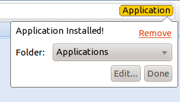

 A million apps isn't cool. You know what is cool? A Billion bookmarks.

The Chrome Webstore is broken, Chrome's concept of web apps are broken. In large part, this is because it doesn't add anything to the experience. In fact, this strikes me quite often as a common trend in a greater epidemic facing "app stores" as they exist. It's pretty much a buzzword nowadays and every moderate-to-large sized vendor is aching for their own piece of the exceedingly profitable business. But one of the first casualties in such a system is search, indeed search quickly breaks down in the face of product growth.

App stores are in general terrible for discovery because they just suck. Search is useful for one thing and basically one thing only, that narrow set of circumstances where you know exactly what you're looking for (via a name, or some weird set of mnemonics which were subliminally embedded into your imagination). For actually discovering products, it's more or less useless unless it fills a pretty much commoditized space (doing some pretty obvious and simple action, in such a way that competitors would have pretty much no way to differentiate).

Chief among the criticisms is that Chrome apps are just glorified bookmarks. But that's not really my complaint, because I think their fault comes not from being too much like bookmarks, rather, I'm complaining that they're too _unlike_ bookmarks.

Here's a pretty lame mockup of what I would imagine the interface for installing applications should be. Via some HTML meta tag or some other markup, the browser detects that that page is actually some "application" type thing, and renders a little icon (or in this case, since I have no idea how to graphically depict something as nebulous as a generic application, a hideously backgrounded sans-serif text thing), perhaps replacing or to the side of the traditional bookmarks star.

The functionality would be quite similar, except that at that point, the interface differentiates between them in some special way (or not). But the whole app differentiation has always struck me as useless in the context of the web anyway, like it was detailed in some of my older blog posts, I think what we really need instead are better ways for elevating permissions to so-called normal web applications.
