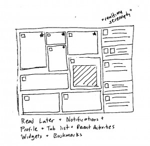
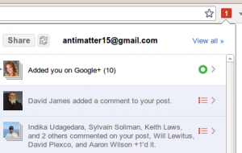
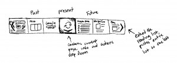

In light of recent events, Mac OS X Lion, iOS 5, Facebook Timeline, Windows 8, Chrome OS and Google+, I've been collecting some thoughts about where this is all headed in the near future. I think it really boils down to a view that all evolution is inevitably convergent and I might as well try writing something out before becoming one of what [Andy Samberg calls](http://www.youtube.com/watch?v=WCuvzENr4oY&amp;feature=player_embedded) the "800 million+ people who claim they invented Facebook", or in this case, the _next _Facebook.

## Tabs

I would argue that tabs are [what started](http://en.wikipedia.org/wiki/Firefox_2) the [second browser war](http://en.wikipedia.org/wiki/Browser_wars#The_second_browser_war), and thus the current drive toward (post-web 2-oh html5) rich internet experiences. Browsers are the modern operating systems, they live independent of the underlying kernel and encapsulate [nearly all user interaction](http://xkcd.com/934/). The tab bar indicates web pages and applications currently running, loaded into memory - a concept developed long before for desktop operating systems through the Dock and the Task Bar. As Browsers became further abstracted and the resizable window paradigm grew unwieldy, tabs were developed and browsers were doomed to repeat the history of the desktop activity list.

It follows that the future of the tab bar is the future of the activity list. iOS and Windows 8 introduce interesting concepts for this post-tab world. Multitasking is transparent, and applications are evicted from memory at the operating system's discretion. iOS and Lion bring the paradigm of applications which save their state transparently and without user interaction, something that will form the basis of the post-tab era.

Since applications and pages can be evicted from the browser due to memory constraints, there's no technical reason for having users close tabs. The result is a leaner, cleaner, more content-focused interface which makes no distinction between what has been visited, what will be visited, and what could be visited.

There is, however another purpose of the Tab bar. It's that of a short-duration reading list. While I'm reading an article, I create a number of tabs for ideas referenced in an article which seem interesting, which I have the intention of further exploring when the current article is no longer of interest (ideally, for this article, after finishing reading). But nowadays, many people have external services which manage the ability to time-shift reading: Readability, Instapaper, ReadItLater, etc. The future social operating system will have this all integrated into the very core of interaction through a new Start page which brings together the public, the private and the social.

## Notifications

We start from the premise that every click, every scroll, every flick and zoom is saved to the web. Default private, default public, or default close friends, it doesn't matter. It'll happen eventually.

A few months ago I sketched out a design for where I felt social networking was headed. It would be a two-pane interface, like Twitter where the right pane would be for an expanded interface where comments, links and images could be viewed inline. The interesting difference is that rather than a mere temporary place for showing more information, it remembers. Items viewed on it get added to it. From there, get bumped up to the top of the list whenever they're interacted with, forming an interactive inline notifications pane, somewhat like Google+.

What Google+ and Facebook assumes, is that every post that you've interacted with, by commenting or liking, indicates interest. Once interest has been indicated, subsequent changes to the topic of interest, be it additional comments or likes, trigger notifications.

Everything that the user reads, writes or comments on through the social network is added to the notifications pane. Since the notifications pane and profile page contain essentially the same information (all things read, written or otherwise interacted with), the only defining difference is that the notifications pane is sorted by recent changes and the profile is strictly chronological. Whenever a post is commented on, edited or liked, the event causes the item to bubble up to the top of all the notification panes of all subscribed users. Like Google+, Google Reader or Gmail, users can mute posts to prevent the post from bubbling up again.

Extending the tab-bar/read later paradigm, the middle button is no longer "open in new tab", but "add to notifications pane". As the notifications pane will be featured prominently on the Start page, and probably navigable through simple gestures (on a touch driven device) or keyboard/mouse shortcuts.

## Interface

Even in a post-tab world, there is still some utility in having a bar which indicates varying places for quick navigation. Modern tab bars fit a variable number of tabs, this isn't tremendously useful, as there's a certain point at which having too many tabs open results results in a terrible mess where none of the pages are really even identifiable. So instead, my design contains a fixed number of visible pages. Previews could be shown in thumbnails (as depicted above) to increase the size of the clickable region on touch devices, or entirely textual on a desktop system which has the luxury of precision pointing through a mouse.

The future tab bar is divided into three sections, the past, the present and the future. The past is a brief list of previously visited pages, probably more than the three items I actually had in my sketch. The entire bar can be panned either by the scroll wheel or the two arrows positioned on the left and right edges. It's ordered left to right, with the rightmost being the most recently visited page. New pages would flow in from the right, so going back would mean clicking the button closest to the

Between the future and past sections is the present, a narrow bit of space which contains information and additional actions for the current opened page. It would function as a drop down, and hold actions like refresh, view source, and whatever else people come to think of.

Privacy

Facebook Timeline envisions your profile as a museum of you, and sees you as its curator. It sees every event, every tiny social interaction as the basis from which it derives a perpetual memorial of your life. This social network can not be limited to the island which is Facebook and must permeate through every nook and cranny of the web. As dystopian as this may appear, we are in a gradual shift to a world where every action is logged and social.

We'll be eased into a world where every application or page that we navigate stores every interaction to your social network. It's quite likely that it'll start off like Google+'s Instant Upload feature for Android devices, where every photo taken is transparently and instantly uploaded to Google+. Or like iCloud, where every action you take on your phone gets saved online.

It's by default, to a private album on Google+ or iCloud. But through this frictionless experience, sharing can be made so easy that you might as well share it- constantly reminded through the start page that you haven't yet shared those pictures you took at Starbucks earlier today, as if that was your intention all along. The interface holding the public and the private will become one and the same, as you end up with less of the latter and more of the former.

Inevitably, every link you click, page you view and every article you save will be stored online, barred from the public world by a mere, and increasingly thin, membrane of separation. Cloud backup services, like iCloud and Google Chrome Sync will become integrated with their respective social networks.

Of course, it's not really a bad thing. Privacy exists where it's needed, and doesn't when it's not. For most activities which people feel demands some degree of privacy, they wouldn't mind explaining if a friend were to walk in. More frequently than not, the legitimate privacy concerns stem not from a lack of trust in friends, but lack of faith in the competence of the medium- Facebook, Google or the Government.

But a fear of potential abusers won't ever be pervasive enough to stop the revolution. Every new announcement in the progression by its perpetrators will be marked by a number of commentators, musing of the dangerous slippery slope of the approaching precipice. But every time, the cliff feels only a little bit closer than before, and as a whole people, [we forget faster than ever](http://books.google.com/ngrams/graph?content=1880%2C1900%2C1920%2C1940%2C1960%2C1980%2C2000%2C2010&amp;year_start=1800&amp;year_end=2000&amp;corpus=0&amp;smoothing=3).

## Sharing

The cool thing about

&nbsp;

&nbsp;

I guess that means I'm one of what [Andy Samberg calls](http://www.youtube.com/watch?v=WCuvzENr4oY&amp;feature=player_embedded) the "800 million+ people who claim they invented Facebook".

Imagine for a moment, a futuristic (and for some, dystopian) operating system. Every document you open or write, every song you listen to, and every photo collected automatically being saved to a social network. Google has taken steps to that with [Instant Upload](http://www.google.com/support/mobile/bin/answer.py?answer=1304818), where every photo you take on the camera is automatically uploaded to Google+, albeit to a private album. Facebook is doing much the same with the [new Open Graph API](https://developers.facebook.com/docs/beta/), except rather than default-private, it's default-public.

This futuristic OS won't even have a "Add To Timeline" button, like what the new Open Graph API has, it'll be absolutely transparent. Navigating to a web page entails an addition to the user's history. Default-public would probably be too creepy for such a scenario, but something Instant Upload-esque would be a strong possibility.

Whatever this future operating system does, it'll need a strong integration with the web. Whether all apps are made with HTML/JS/CSS doesn't really matter, but whatever it is, it needs to have some web-like attributes like being able to be opened instantly without any naggy registration, login or installation from a URL (actually, the URL might not even matter in this future).
