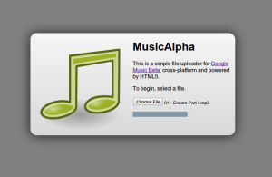

So yeah, I just got a Music Beta invite today, and it's pretty cool except for the fact it doesn't have any means  of uploading besides the desktop application on Windows and Mac.

So, after a little packet sniffing, I got the basic idea of how it works. You send a POST to some URL with some info and then that returns a URL that you PUT to in order to add the song.

So pretty soon, I hacked together something that almost sort of worked, with one rather significant caveat: It doesn't pick up any tag data, name, time, artist, album, etc. I can't figure out why. I guess I'll try some more tomorrow.

The prototype is at [https://github.com/antimatter15/musicalpha](https://github.com/antimatter15/musicalpha)
