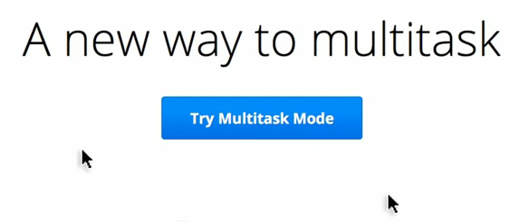

Google's multitask mode was only an April Fool's joke, but inordinately amused among us (read: me) might even venture into attempting such an irrational feat. While watching the video, it evoked some memories of something which I had stumbled across a few years ago, called Multi-Pointer X. The rationale for creating that wasn't nearly as insane as the Chrome Multitask video made it out to appear, instead I think it was just the framework to support multitouch and other sorts of alluring interactions on the Linux platform.

So I decided to look into that again and within a few minutes of Googling, it appears that Multi-Pointer X has now been incorporated into the X.org mainline as part of XInput2\. So what exactly does it take to conjure and insult the multitasking gods?

The first step is quite logically to plug in another mouse. I happen to have three mice plugged into my computer anyway (there's a perfectly logical rationale for how this came to be, my keyboard is some  wireless Microsoft keyboard+mouse set but I really hate the scrollbar on the Microsoft mouse, so I instead used another mouse for the longest time until it started failing and sheer lethargy prevailed over disconnecting that obsoleted peripheral) but regrettably, I don't have an additional prehensile appendage to operate the third mouse.

Right now I'm using a pretty much unmodified version of the latest version of Ubuntu 11.10\. I just opened up a terminal window and typed in "<tt>xinput list</tt>"

`antimatter15@antimatter15-desktop:~/online$ xinput list
⎡ Virtual core pointer id=2 [master pointer (3)]
⎜ ↳ Virtual core XTEST pointer id=4 [slave pointer (2)]
⎜ ↳ A4Tech PS/2+USB Mouse id=8 [slave pointer (2)]
⎜ ↳ Microsft Microsoft Wireless Optical Desktop® 2.20 id=11 [slave pointer (2)]
⎜ ↳ USB Laser Wheel Mouse id=9 [slave pointer (2)]
⎣ Virtual core keyboard id=3 [master keyboard (2)]
↳ Virtual core XTEST keyboard id=5 [slave keyboard (3)]
↳ Power Button id=6 [slave keyboard (3)]
↳ Power Button id=7 [slave keyboard (3)]
↳ Microsft Microsoft Wireless Optical Desktop® 2.20 id=10 [slave keyboard (3)]`

Use the command "<tt>xinput create-master Auxiliary</tt>" in order to create a new input device, and try running "<tt>xinput list</tt>" again to confirm that the command has done your bidding.

`antimatter15@antimatter15-desktop:~/online$ xinput create-master Auxiliary`

Now it's time for the third (or is it fourth) and final step, to reattach one of those master pointers into the auxiliary pointer. To do that, pick out some mouse. For me, I picked my "<tt>A4Tech PS/2+USB Mouse</tt>" which is was my mouse with a broken scroll wheel. You can see that it's been given <tt>ID=8</tt>, so that's the number I'll be using for the next step.

`antimatter15@antimatter15-desktop:~/online$ xinput reattach 8 "Auxiliary pointer"`

And then I can now use two mice at the same time for whatever ungodly purpose I desire.'

It's hard to take screenshots since it appears that every screenshotting or screencasting app which I can find seems to make the wholly unwarranted assumption that a desktop computer only has one cursor, but it does actually work. Though I don't think I'll ever be able to multitask through this scheme, it's mentally jarring in far too many ways.

&nbsp;
