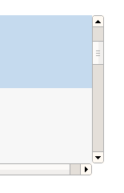

So here's a somewhat technical post, actually it's pretty technical. But either way the premise is sort of simple to understand, and probably so is the context. I'm working on Swipe Gesture 2.0, which basically tries to take Chrome and Safari on OS X Lion's awesome back-forward transitions and make them work on other operating systems. See, the thing is that multitouch isn't _strictly _a requirement for it to work, a lot of computers just have the little bars on the bottom and right of the track bar (often with a little somewhat abrasive textured surface so you don't accidentally tread upon it). Regardless, the title is a bit of a misnomer, because even though the event is called the "mousewheel", it's hardly meant to be observed from an actual mouse (or a wheel), instead it means the scrolling gesture on some kind of trackpad, either multitouch or not.

Well, first, I guess I'll talk about the difference between how Lion and Leopard do it. The way Leopard did it was pretty cool but not particularly applicable to other platforms since it relied on the existence of a three-finger gesture. As in, you needed some kind of touchpad which was cool enough to support three-finger multiouch, _reliably_. It also behaved completely independent of the current zoom or scroll position, which makes implementation in software entirely trivial given access to some drivers which can recognize three fingers on a touchpad.

Lion did it a completely different way. Instead of creating an entirely new gesture which was entirely dedicated to the singular task of navigating through history, it conflated the notions of scrolling with navigating, which sort of makes sense. Apple's quite dedicated to skeuomorphic metaphors, and they want to treat the web more like _literal pages_. A user can move it around to better keep certain things in view, and the physical movement to slide a sheet out of view is just an extension of that panning gesture.

However, technically this poses a completely different challenge, because this requires you to distinguish between scrolls and navigation requests. Scrolling is always the default behavior, but the navigation swipe gesture happens when scrolling wouldn't actually result in anything. However, many implementations of scrolling are at least somewhat kinetic, often it's emphasized in software (in the form of smooth-scrolling) or hardware (scroll wheels that don't click but instead move basically freely) or because your arm has to obey the laws of kinematics (unless it doesn't, in which case that's certainly fascinating). So not only does the software have to determine when a mouse wheel action results manifests as a scroll, it has to see if it was the user's intent to do the extraneous scrolling.

This is done by clustering the mouse wheel movements together temporally. Scroll events flow in in discrete chunks, and you can split events off into little buckets (in a sense), where if there isn't any event sent within some arbitrary threshold (say, 500msecs or half a second), you stick stuff in a new bucket. This way, lets say you scroll from the top of the page to the bottom and you're sort of excited, and spin the wheel as fast as possible, you hit the bottom of the page but it's not some instant stop. You continue scrolling (because you're just that excited, and just can't stop) for a little bit more. Ignoring the fact that you probably won't have a vertical/horizontal event handler (though there are some sort of intriguing possibilities for this, one idea is to have the upper threshold trigger full screen). Without segmenting them into certain buckets, it doesn't recognize that the time when you're ramming into the top of the page is part of the same general gesture as when you were scrolling, and it may interpret that as an intentional gesture. So that's one part which makes it a bit more complex.

So now, you have these series of `mousewheel` events conveniently delimited into little gesture-chunks. The next part is determining whether or not the gesture-chunks are part of a scroll action or not.

Thankfully that's a really simple thing to do. Just look at the document's scrollTop and check if it's zero (or scrollLeft for horizontal stuff) or whatever value is the width of the element. If it can't scroll no more, then you have a winner and you can start the falling balloons and confetti.

Except it's not that easy, because the document isn't the only thing which can scroll. Thanks to the glory of `overflow:scroll`, there are lots of things which can scroll. Things which aren't necessarily documents may be in arbitrary scroll positions to wreak havoc on your well-meaning heuristics.

So back to the drawing board, I guess. Actually, to think of it, maybe it's simpler to listen for the `scroll` event, which fires when a scroll happens, and quite intuitively doesn't fire when a scroll doesn't happen. And mouse wheel actions always precede scroll ones (because the wheel events bubble and are cancelable, so you can prevent a scroll from happening). The only problem is that scroll events don't bubble. As in, when a scroll event happens on some element, it's not going to show up on the document, it's only going to show up if you're listening on that specific element at the right point in time.

The naive approach to this dilemma is just to attach a scroll listener to every single event on the document, and to reattach to some other elements whenever the DOM tree is modified in some way. This means the overhead grows rather significantly when pages are larger, in a way which could be likened to O(n) time where n represents the number of nodes in the document. If you want, you could lazily do it by attaching the scroll listener only once the wheel event has fired, but that would cause a significant delay when attempting to legitimately scroll.

Another thing you could do, is to make another assumption: that the element which gets scrolled has to be some parent of the element which the mouse is currently over. Making that assumption, we can add a `mousewheel` listener to the root of the document, as those kinds of events actually do bubble. And since they're mouse events, once you capture it, you can get a `clientX` and `clientY`, comprising the current coordinates of the mouse. And with that, you can get the element immediately below the cursor with `document.elementFromPoint`. And since the scroll might fire on any one of the elements which are parents of the current element, you ascend up the tree and add a listener on all of those (until, of course you hit the document element, at which point you can't go any further up). This yields performance which could essentially be modeled with O(log n), quite a bit better than O(n).

So now the finished process is fairly simple, you listen for a mousewheel event, and when it happens we determine the element, and ascend the tree, yada yada. That scroll listener, when fired, sets a global variable `lastDetectedScroll` to the current timestamp. We set a little temporary variable set to the before time and then we set a little timer, 150 milliseconds. It usually only takes like four to see if a scroll thingy happened, but let's be safe by having an order-of-magnitude threshold. The Cuckoo clock rings, and we check if the `lastDetectedScroll` is the same thing, and if it is, it's a swipe, and otherwise, it's a scroll.

Here's a little demo: [http://antimatter15.com/misc/experiments/swipe-gesture/minimal.html](http://antimatter15.com/misc/experiments/swipe-gesture/minimal.html)
