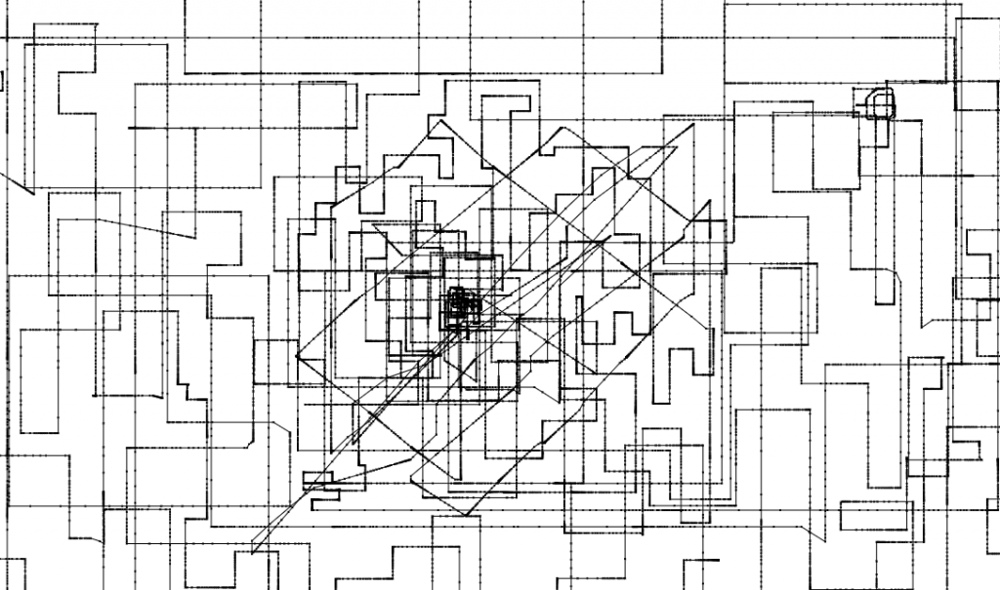

So I was testing the responsiveness of the Samsung Series 5 Chromebook touchpad and made a short little script which basically continuously adds the mousewheel changes and draws them using canvas. But it appears that the trackpad does some kind of fitting to make things tend to be at right angles, though it's not hard to get something diagonal or even somewhat circular.

[http://antimatter15.com/misc/experiments/swipe-gesture/responsive.html](http://antimatter15.com/misc/experiments/swipe-gesture/responsive.html)
