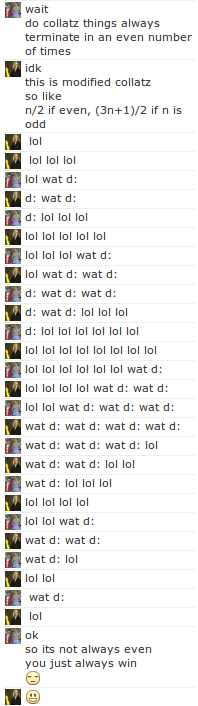

Okay, so I really want to maintain at least [one blog post per month](http://antimatter15.com/wp/2012/08/upcoming-changes/), and here I am, right before New Year's with no apocalypse in sight to rapture me away from having to write a blog post. I don't have anything particularly interesting ready to share, so here's something fun that only took a few hours.

The rather long [Bayeux tapestry](http://en.wikipedia.org/wiki/Bayeux_Tapestry) of an image I have crammed to the right marks the culmination of a series of rather odd tangents. It also serves as a reminder for me to [abandon hope](http://en.wikipedia.org/wiki/Inferno_(Dante)#Overview_and_vestibule_of_Hell), because the shape of the conversation forces whatever post I plan on writing to be verbose enough as to fill all that vertical space so that the actual text here isn't dwarfed by the image, which would be aesthetically jarring.

It all started the day before yesterday (I'm pretty sure it wasn't actually then, but this is my abridged timeline and I'm entitled to indulge in whatever revisionist temptations I have as I'm writing this at a rather late hour, because 2013 is creeping closer at an uncomfortably fast rate and I still have some finite quantity of homework I haven't attempted to start over the course of the past week), when my friend Robert realized that a rather significant portion of my chat responses include "wat", "walp", "lol", "yeah", ":P", "cool". From that, he logically sought to create a naive bayes predictor of me, because, why have a person nod in consent, when you can have a robot which can, to some degree of accuracy, automatically give that nod of assent without bothering a physical human being.

This isn't quite the same thing as a traditional chat bot, because traditional chat bots don't pretend to be actual people, largely because the state-of-the-art of artificial intelligence is quite a ways off from creating something which can suitably pass a Turing test, and even further away from being able to learn the entire knowledge of a person and provide an intelligent response to every imaginable stimulus. A closer approximation would be that this is a sort of semi-automated chat-macro system, whereby my generally useless responses of agreement are outsourced to a rudimentary script, fully capable of replicating my own rather unhelpful self. And from that it's able to try to behave human by replicating a very very narrow subset of activity, deferring to a real human transparently.

It's somewhat like how GMail has a [priority inbox](http://support.google.com/mail/bin/answer.py?hl=en&amp;answer=186531) feature which uses magical algorithms to separate the wheat from the chaff, diverting your attention away from the less subjectively important emails toward the few which actually matter. Except instead of giving the user ultimate discretion over the emails, this one would simply reply with "lol".

It's pretty easy to see any realistic application of this as rare. But I could totally be wrong, and I could be seeing this from totally the wrong angle. It's entirely plausible that some subtle variant of this idea is absolutely brilliant, and will serve as the future of networked communication for decades to come. Maybe as email evolves the way of the Dodo, Instant Messaging will become the semi-permanent high-persistence low-immediacy ironic-initialism that [takes email's place](https://medium.com/product-design/d8d4f2300cf3), and the  rest of the world becomes burn-on-reading SnapChats. Maybe SnapChat gets combined with lifelogging, and every minute of your life gets divided into four second snippets, and sent to one of your four thousand middle-school friends, so they can bask in the new hyper-intimate super-network, fueled by non-discretionary artificial intelligence filters.

That was Robert's end anyway. He went on combing through our accumulated ~30,000 messages with his handy Mathematica trying to identify pertinent features which might probably replace me. On my side of the thing, I started with the userscript which would run on my browser to intercept the messages he sent, process them, and to send out a response, if a suitable automated one existed.

This actually turned out to be slightly more difficult than I had anticipated, for a single reason, and it was and has been the same reason that has bothered me for quite some time. Firing events. I really probably should learn how to use Selenium or something to automate things in a nice and clean way.

And that's completely ignoring the five hundred pound trivial solution in the room, which isn't to use a 500lb gorilla as a metaphor. Facebook supports XMPP which is a nice open source protocol with a billion implementations and it's really not that hard to automate. I mean I've even done it before. [I have a Raspberry Pi](http://antimatter15.com/wp/2012/08/raspberry-pi/) after all, and I can use it to run useless services like this, because I've decided that that's exactly what a Raspberry Pi is for. But I didn't and I have no idea why. C'est la vie, I guess.

The secret ended up being to Google a bunch of phrases related to keyboard-event-emitting with initializeKeyboardEvent or something of that sort a lot of times and stealing some code from StackOverflow. It took a few tries, but eventually something that worked emerged, and it was cool.

For posterity, this was the code that worked:

But that wasn't the end of it. No, now there was a piece of code which could convincingly send a message, but it also had to read messages too. That wasn't hard, actually, I just created a MutationObserver object and named it after a[ Fringe character](http://fringe.wikia.com/wiki/September). But then, presumably because Robert's code was still training on that 30k message corpus, or something inexplicable, I built a crappy rudimentary thing with four or so simple regular expression based rules.

One of them happened to be that if someone were to send me the message "lol", I would inexplicably respond as well with "lol". This wasn't initially a problem because the idea was to create a robotic version of _me_ and _only _me. But Robert found it cool too so he ran the same script. Problem was, that this meant that if either one of us were to introduce the word "lol", it would spiral nigh perpetually ad nauseam.

Somehow this sparked the idea to implement simple esoteric languages on it. The first one was a simple substitution rule. 0 -&gt; 1, 1 -&gt; 10\. And over a few iterations it grew and took up huge amounts of space.

Next up was implementing a [tag system](http://en.wikipedia.org/wiki/Tag_system). I implemented the 2-tag collatz sequence one. The cool thing is that it's actually insanely easy to implement. You just take a sequence of symbols, strip the first two, and append the first symbol after you've transformed it according to a certain transformation mapping.

It was interesting as each little computation of this tiny esolang of a chat conversation involved a round trip of hundreds of miles. But each tag was still letters, 'a', 'b', and 'c'. And it was getting late, and I thought that maybe it would be nice to hark back at inside-joke/theory of sorts that sparked it all. So I decided that our tags could be, instead of solitary letters, comprise word symbols like "lol", "d:" and "wat", which perhaps is a subconscious reference to an old webcomic that I had posted a while ago about a steganographic system built on internet vernacular.

I updated my script, posted it to him, he ran it, and initiated it all by saying "lol lol lol". And from then the line lengths grew and shrank like mountainous terrain, eventually converging on the final state, a solitary "lol". And for some inexplicable reason, some weird quirk of fate, or some deeper underlying truth to the universe, Robert always got the last "lol". When I had tried it with a random initiating code, it would always terminate in some odd number of iterations, leaving me with the lowly penultimate laugh.

It sort of broke after that, and we didn't fix it.

Nonetheless, there's something incredibly cool about how an idea for something questionably turing-test-worthy can evolve into something turing-complete.

And that's a basic summary of how uneventful my winter break has been, incidentally written with exactly 1337 words.
