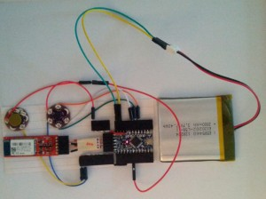

Recently, I've been racking up on hobbyist electronics components from [Sparkfun](http://sparkfun.com). Actually, this has been going on for quite a while, and most of that spending was justified by this project, which currently has the working name of the "pedant" (which is like at least a three-layered pun). I won't say that it's my very first foray into building some actual piece of hardware, but it's probably the biggest and most original hardware project I've ever attempted.

I probably won't be able to sell you on what it _is_, because it's actually quite simple and uninteresting in principle. So instead of selling you on the cynical summary of its functionality, I'll gild the concept with buzz words and try my very best to instill the same kind of enthusiasm I have for this project (which might just be because I haven't done anything before with e-textiles or other electronics stuff).

The **pedant is my foray into augmented reality, **hopefully that means that it's, at least some ways, original. It's **cheap**, though actually in retrospect, not nearly as cheap as it _should_ have been. And probably the most interesting aspect is that it skips through the whole perceived evolution of augmented reality from some bulky extremity into something sleek and unobtrusive. That's not technically untrue, because the actual device will be fairly bulky, but it would exist in an already considerably bulky device (a shoe), so the **net effect is that it's sleek and unobtrusive**.

I can't say I was into that whole augmented reality thing before it was hip and cool. I only got interested in it fairly recently, likely due to somewhat high profile forays by Google and others. In mid-to-late 2008, I had just gotten my iPhone and I was _deeply_ attached to it. At one point, I was on a vacation and at one point there was some arbitrary fact which came into question, at which point I pulled out my glorious first generation iPhone with its pristine anodized aluminium backing and loaded an app which searched an offline copy of all the textual content in the English Wikipedia (a concept which I had become so attached with that I ended up making Offline Wiki for the same reasons). And as the question was settled, the new subject of conversation was how incredible it is to keep all the world's knowledge in a palm sized device.

But that's not just an anecdote about the marvels of technology, it's also a sad tale about how distracting it was. Somehow having access to that information allowed whatever _pedantic_ instincts to prevail, shifting the conversation from a meaningful discussion into an artless digital query. And even forgiving that fact, it was slow and distracting, destroying the asynchronous exchange of ideas by creating this handheld bottleneck. Yes, we got an answer, but at what cost?

And I think that is a beautiful way to frame the argument for augmented reality. That whatever reality we have now is already being corrupted by the influence of the virtual world, and that only by willfully acknowledging that they both share the same space, can we start in the right direction of fixing it. That's the direction Google's Project Glass is headed, and I think that's the right way.

The approach taken by the [SixthSense](http://www.pranavmistry.com/projects/sixthsense/) project and by Google Glass mainly interacts with the user in a visual manner. And for the latter, there isn't any really "good" and unobtrusive way to interact with that information. Both of the projects have extremely high output bandwidth (conveying information by projecting it into the user's eye in one way or another), but limited input bandwidth and still fairly non-discreet (waving hands around to form shapes and sliding a bar on the frame, respectively). The Pedant takes a different approach by focusing on tactile input and output. This places the project more in the league of people who [implant magnets under their skin](http://hackaday.com/2012/05/13/hacking-magnets-into-your-skin/) by hijacking the sense of touch to convey information about the surroundings.

It's going to be a tiny device which fits within the dimensions of a shoe insole including an Arduino Pro, a Bluetooth Mate, an Accelerometer, 2000mAh LiPo battery, and three or more vibration motors. By tapping the foot (or by orienting it in slightly different ways) the user can input data in a manner similar to the telegraph. However, nothing necessarily restricts it to being sent through a single "stream", so it could end up more like a chorded telegraph (a la [chorded keyboard](http://en.wikipedia.org/wiki/Chorded_keyboard)). The great thing is that with chording, it becomes much more practical to receive information at reasonable rates.

Just like how a cell phone can vibrate to signal that the user has been left a message, the pedant would be used primarily to handle notifications, but rather than indistinguishable general sensations on the thigh, it'll portray the type of notifications as well as the content, and the user even has the possibility to respond without changing the environment.

Without weird tactile abstract character sets, the Pedant could be interesting just as a sort of social network where users can feel the presence of other users in their general vicinity. It could monitor the footsteps of all nearby Pedant wearers and as it's connected via a cellular data network and a smartphone GPS to trigger the specific vibration motors to evoke an awareness of how fast they're walking and what general direction they are. In a sense, a social network of pedometers.
