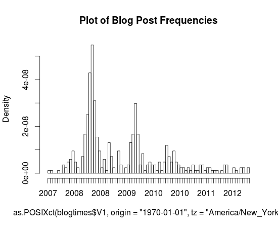
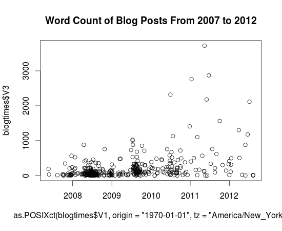

I've been maintaining this blog, or at least the content inside it for about five years now. It's been through a handful of incarnations, often paired with significant changes in web hosting. I've had a blog for a little bit longer, but I don't think I have the medium figured out. The structure of the posts and the style has changed over the past few years, but I can't at this point call it evolution, a positive progression. Part of the power which lies in analyzing data is the ability to realize patterns, often at a different scale from human observation (spans of months or years) which are equally if not more insightful.

That's been my personal attraction to data science. I've had a couple of personal experiments involving collecting data about my daily activities, my old writing and code in hopes of distilling the changes that I'm too conceited to admit without the infallible hand of statistics. For nearly two years now, I've logged my entire life within precision of approximately 30 minutes from Google Calendar (or the Calendar app on iPad which syncs to Google Calendar). Actually, the label is slightly off, I quite often dedicate large spans of time to more or less useless labels like "not productive". But this temporal information falls apart in terms of its richness, for my schedule is dictated more so by the mandatory rhythms of school life than the drifting cadence of other behavior.

But I digress. This isn't about why I collect data so much as "I have this data, now what?". In this case, I had a hypothesis, a rather simple albeit morbid one at that "my blog is dying". It's not hard to see how I'm coming at the conclusion. I'm pretty much struggling at this point to meet my goal of one post per month (itself not a particularly difficult goal, but as time has gone on and my posts have become more infrequent, I feel more compelled to write obscenely long posts to compensate, but of course this also leads to big posts sitting there unfinished for long durations losing the sort of one post = one sitting mentality). But before I ramble for too long, I'll cut to the chase and answer the question posed at the beginning of this paragraph: "Graphs." (you could imagine those haunting glyphs levitating in the midst of air caught in the invisible grasp of Giorgio A. Tsoukalos, or better yet, I can spare your cognitive abilities by [making it real](http://qkme.me/3qj5f6))

Here's a pretty little graph I made in R (sorry for the mess on the horizontal axis, and I just realized I have no idea as to how to interpret the dates, I'm assuming that they're linear and it's just some odd aliasing issue that makes even-numbered years repeat twice), it's a histogram of the dates of posts that I've made to this blog (extracted with a simple Python script and Wordpress's built-in Export button).You can probably actually tell that the blog's demise is quite a long way's coming. Every annual peak ends up shallower the following year and the first time _gaps_ have actually existed was this fateful year, 2012.

It's actually sort of interesting that these peaks exist, but I can't really tell during what months that happened during (since these axes are labeled so terribly, it'd be nice if I knew some nice interactive graph engine that worked with histograms, something like that cool time series viewer that Google had for Finance for like ever but for histograms, but I guess that just shows how much of a non-scientist I am, to have no idea how to fluently articulate in a statistical or graphical language of my choice).

For more graph fun, here's a scatter plot of word lengths as a function of year. I wasn't dedicated enough to figure out how to get [NLTK](http://nltk.org/) to tell me the [Gunning-Fog](http://en.wikipedia.org/wiki/Gunning_fog_index), [Flesch-Kincaid](http://en.wikipedia.org/wiki/Flesch%E2%80%93Kincaid_readability_test) or [ARI](http://en.wikipedia.org/wiki/Automated_Readability_Index) value for individual posts, and I doubt that would end up showing anything particularly insightful. But yeah, so here it is. Charts. Charts of words. Note that thing that sticks out clocking in at around 3724 words is my first [Music Alpha](http://antimatter15.com/wp/2011/05/uploading-mp3s-to-google-music-beta-from-linux-chrome-os-win-and-mac/) post.

Actually, I won't mind that Wordpress isn't yet self aware ('ello Skynet) and still sends trackbacks and pings (whatever they are) to me when I link to myself. Seriously, you _don't actually need to have a self-aware artificial intelligence in order to learn how to not spam me with emails when I'm quite probably as in super definitely aware of its existence_. But anyway, I guess I'll stomach the lurching pain of a thousand emails (I'm using hyperbole here, in case your rudimentary artificial intelligence algorithms can't quite distinguish them, but I'm also pretty sure your algorithms wouldn't be able to handle n-th degrees of meta, so this excruciatingly useless parenthetical wouldn't be much other than that: excruciatingly useless) and post the last part of the list here.

    1340133957.0 , 2012-06-19 19:25:57 , 1178 [http://antimatter15.com/wp/2012/06/pinball/](http://antimatter15.com/wp/2012/06/pinball/)

    1333025085.0 , 2012-03-29 12:44:45 , 1302 [http://antimatter15.com/wp/2012/03/musicalpha-v2-0/](http://antimatter15.com/wp/2012/03/musicalpha-v2-0/)

    1293394934.0 , 2010-12-26 20:22:14 , 1409 [http://antimatter15.com/wp/2010/12/drag2up-v2-drag-and-drop-uploading-for-all-sites/](http://antimatter15.com/wp/2010/12/drag2up-v2-drag-and-drop-uploading-for-all-sites/)

    1317686582.0 , 2011-10-04 00:03:02 , 1565 [Haven't actually published this yet, hmm]

    1341591648.0 , 2012-07-06 16:20:48 , 2117 [http://antimatter15.com/wp/2012/07/cloudfall-a-text-editor/](http://antimatter15.com/wp/2012/07/cloudfall-a-text-editor/)

    1307064165.0 , 2011-06-03 01:22:45 , 2180 [http://antimatter15.com/wp/2011/06/why-the-chrome-web-store-is-bad-for-the-web/](http://antimatter15.com/wp/2011/06/why-the-chrome-web-store-is-bad-for-the-web/)

    1277922545.0 , 2010-06-30 18:29:05 , 2319 [http://antimatter15.com/wp/2010/06/wave-embed-api/](http://antimatter15.com/wp/2010/06/wave-embed-api/)

    1294958307.0 , 2011-01-13 22:38:27 , 2762 [http://antimatter15.com/wp/2011/01/the-ambiguity-of-open-and-vp8-vs-h-264/](http://antimatter15.com/wp/2011/01/the-ambiguity-of-open-and-vp8-vs-h-264/)

    1308832860.0 , 2011-06-23 12:41:00 , 2872 [http://antimatter15.com/wp/2011/06/samsung-series-5-chromebook/](http://antimatter15.com/wp/2011/06/samsung-series-5-chromebook/)

    1305426252.0 , 2011-05-15 02:24:12 , 3724 [http://antimatter15.com/wp/2011/05/uploading-mp3s-to-google-music-beta-from-linux-chrome-os-win-and-mac/](http://antimatter15.com/wp/2011/05/uploading-mp3s-to-google-music-beta-from-linux-chrome-os-win-and-mac/)

That list was compiled by the command `cat blogtimes.csv | sort -t',' -k3n | tail`, and that's quite an accomplishment because I had to look up the arguments for the `sort` command in order to figure that out. Of course, `blogtimes.csv` is the output of my magical six line python script (which uses BeautifulSoup to extract all the `wp:post_date`s).

So, with 10 blog posts in that list, every single 8 of them happened after 2011 and 3 of them happened in 2012\. Considering that there were 10 things published in 2012 (according to my dataset) and 21 in 2011, that's a rather significant fraction of the stuff which has been written recently to be insanely long.

Wordpress tells me this post is now at 948 words, so I guess I'll add a bit of concluding at the end to push it over the magical power-of-ten barrier, so presumably you should brace for the terrible boom which occurs at this point (oh, what's that? I think that's my imaginary telephone operator who informs me when I make a factual error, apparently those kinds of booms only happen with waves, and apparently words flowing through word count orders of magnitude don't count).

The original title of this post was "Meta Analytics &amp; Upcoming Changes", but in the spirit of the upcoming changes, I've moved the "Upcoming Changes" part into its own post (tentatively titled "Upcoming Changes"). You can probably at this point guess that "Upcoming Changes" involves something to tackle the excessive verbosity and to mitigate the absurdly infrequent posts. This probably doesn't sound nearly as heroic to you as it does to me, because I'm listening to The Avengers soundtrack right now, and "A Promise" is pretty dramatic.
