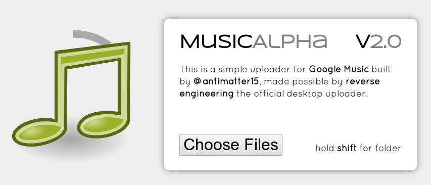

[**MusicAlpha** ](https://chrome.google.com/webstore/detail/obojocfchdgdpgcigcdhdnlakfcbbgfn)works again, and this wasn't some minor update that fixed a small hole, the entire app has been rewritten. There's a new user interface which has really quite beautiful animated polar progress bars, but the most significant part is that the mystical protobufs-over-https protocol has been decoded and documented.

It really started on January 30th, when [Simon Weber](https://github.com/simon-weber) contacted me for information on the upload process because his [Unofficial-Google-Music-API](https://github.com/simon-weber/Unofficial-Google-Music-API) received various user requests to implement uploading. I remembered a message sent a little while earlier offering help decoding the protobufs and tried out the method described, which involved using a disassembler to patch the curl_easy_setopt method to disable checking of SSL certificates. This turned out to be the trick and I used Fiddler to collect a few dumps of data for subsequent analysis. That was really quite a magical moment because everything afterwards was relatively straightforward. The huge stumbling block which had prohibited progress for these past months had been lifted and the task which was left, of reverse engineering the protocol, seemed eminently viable. With only minor hiccups over the next few days, I built a python prototype of the program. I created a .proto file which was somewhat human readable with field names based on guesses.We realized some pretty cool things or at least got a much better understanding of how Google Music seems to work (This blog post was started in the early part of February, but I'm finishing this up halfway through March).

For instance, the reason Music Manager doesn't work on virtual machines is because they use the computer's MAC address as a system for identifying individual devices. They have a cap on the number of devices which can be authorized to manage your music, which is currently set to 10\. This caused a bit of confusion when I hit that device cap while testing (At one point I assumed that the MAC-esque field was actually a random string, so after fifteen or so tests everything started silently failing). However, it occurs to me that it isn't particularly interesting to read the narrative of how exactly the current version of the application has come to exist. The technical overview of how the actual protocol works can be found on the [google-music-protocol](https://github.com/antimatter15/google-music-protocol) project page on Github. It includes a brief overview of the mechanism as well as sections which detail the specific messages which are sent to the server and also includes a simple reference implementation. Hopefully it should be enough information for anyone who is actually interested in doing something which relates to it (though I am curious if anyone could possibly create something interesting out of it, please contact me if you decide to do anything at all with it). So at this point, I'd like to skip over to the actual application-specific aspect: MusicAlpha itself. This is the story of how the rewrite came to be, and the rather lengthy time it took to to write this blog post describing it.

One of the first things I realized was that the entire application would essentially need to be rewritten. The code dealt primarily with altering the attributes of a song by mimicking the web client's interface, something which wouldn't be very useful now that all the metadata is sent via the magical protobufs scheme. Since that code gets scrapped, I figured why not scrap the rest. I wrote the first version while experimenting with darker color schemes and obscenely prominent border radii and gradients. I'm not sure that I can say it's objectively better, but it does look a bit more interesting, especially that big two-ringed polar chart.

There's some text to the right side, but it's not particularly of interest. There's a big file selection button, but that's pretty uninteresting. Embroidered on the solid gray backdrop is the logo, a simple and unchanged music symbol- unchanged from the last version. I used, for the first time, custom web typography. Just some fancy looking sans-serif fonts I picked from Google's Font Library. On the old application, I had two progress bars to show the upload progress, one is for individual songs and the other is the overall progress. I wanted to portray upload progress in a manner which was somewhat smoother and more aesthetically alluring than a mere linear bar.

In trying to create that better progress bar, I created a polar progress bar in canvas. All updates are smoothly interpolated and watching the bars spin around and invert is somewhat reminiscent to staring at an old record spin on a turntable, something which I've only seen a few times in my (rather short, at this moment) life, but magical enough to still inspire a sense of nostalgia.

Central to making an aesthetically appealing polar chart is making the animation smooth. This might be doable through various esoteric CSS transforms, but I'm not particularly knowledgeable in that area, and I'm not a huge fan of crafting elaborate animations with CSS. It lacks a certain amount of control (which manually updating and redrawing affords) and tends to feel extremely sluggish on computers which lack extremely modern graphics cards (such as mine). Since things like uploading a file involves a lot of guesswork and various aspects of the upload process are very much stochastic (ie. waiting for the server to respond), the smoothing system needs to be able to create a nice smooth animation out of highly erratic information. But it also needs to simultaneously relay information without having an excessive amount of lag.

In order to strike a sort of balance, it uses an interpolation algorithm which was employed in Steve Wittens'[ js1k entry](http://acko.net/blog/js1k-demo-the-making-of/) and you can see [my code](https://gist.github.com/2236530) here. In order to minimize the CPU tax of running such an animation, it uses the HTML5 requestAnimationFrame function. This has the nice side effect that when you leave it uploading in the background for a while, it automatically stops updating the animation and quickly slides into position when you return.

There are two rings, the outer one being dark gray and the inner one being a somewhat lighter shade of gray (fitting into the mostly unsaturated theme of the interface). The outer ring represents the total upload progress while the inner ring represents the progress of an individual file. The outer ring "spins" in a sense, in a clockwise manner while the inner ring rotates in the opposite direction. Every time a ring completes a revolution, it "inverts", for instance, when the outer ring fills up and becomes a solid circle, the ring begins to open from the opposite direction so that the imaginary end of the rotation continues unimpeded. The animation is somewhat difficult to describe in words so here's a [demo of the progress animation](http://dl.dropbox.com/u/1024307/musicalpha/animation.html).

When the page first loads, the polar plot exists in the background, behind the prominent logo. It represents the song quota, the percentage out of the 20,000 song quota which Google Music imposes.

While implementing the algorithm, I had a little trouble because of SSL certificates. The domain which accepts all the protobufs encoded information has a certificate signed for the wrong domain, and browsers have a tendency to care a lot about certificate validity. To get around it, those requests are proxied by a simple server which is made with Google App Engine. All communication with that server itself is signed as well, and it doesn't do any logging.

When I was about to publish this post and first announced that it works again, there was a bit of trouble which people had getting it to work. This was actually because Google Music allows each MAC address to be associated with a few accounts but forbids any additional accounts. The first released version would use a single mac address for all clients, but it has since been replaced with a sort of unique identifier which is stored in localStorage.

Apparently a[ browser based uploade](http://googlesystem.blogspot.com/2012/03/upcoming-google-music-features.html)r may be something coming soon to Google Music. Enjoy[ this app](https://chrome.google.com/webstore/detail/obojocfchdgdpgcigcdhdnlakfcbbgfn) while it lasts.

&nbsp;
