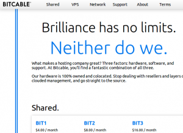

## 

I haven't been particularly raving about Hostmonster for the near two years I've been a customer of their's, and it's time for a change. In the past week, I moved to a new web host. As of this moment, I'm using Bitcable, specifically the cheapest shared plan plus another discount. I've had my share of gripes about the service, but speed and reliability so far have not been among them. I discovered Bitcable through a friend who knew a friend who operated a web host, well, primarily a VPS service. Over a fair amount of begging for a VPS discount, I decided to try out their (I always find it awkward when referring to companies or services as a plural in spite of knowledge that it's pretty much a one-man-show, but that makes it all the more impressive) shared plan, since that was analogous whatever I was paying for with Hostmonster. And anyway, for $2/mo, how bad can it get?

That question was a tad misleading, so far, Bitcable's pretty awesome. Part of the thing about using a service from a friend-of-a-friend (FOAF, if I ever need to use an acronym later on in this post, but I'll keep it here just because it's a fun thing to say) is that you can get some pretty good support over some random communication channels. It's small enough that he doesn't oversell, and the performance really shows through.

I did, however have some issues with the configuration of the server. The first issue is that by default, shared customers don't get SFTP access. That's pretty annoying because I've recently fallen in love with passwordless login using public keys. I sent an angry support ticket and it was enabled soon enough. But a much more pressing issue was that soon after my migration, there was some long server outage due to some power supply failure (which thankfully, since it took over a month to write this post which is more indicative of the bad state that my blog is in than the host, hasn't happened again, I haven't noticed a minute of downtime since then and I've set uptime monitors to ensure that).

So yeah, I'll be on this host for the foreseeable future.
