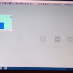
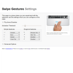

So I'm trying something new, returning to quasi-daily somewhat short updates about the development of whatever I'm working on rather than withholding everything until something of somewhat acceptable release quality is achieved. I have a blog post about that transition, but I'm still working on it (as in, writing it is somewhat boring). It's probably better given my development cycle is quite nonlinear, usually I get something somewhat promising made in the first few days or so and pause for long and possibly indefinite durations doing other stuff in the process. Probably, writing short blog posts about what I have yet to finish will remind me to, well, finish them. Just maybe. But I'm probably going to have to preface every post that I write with this kind of disclaimer until I actually get that post finished and published so I have something to reference rather than pointing crazily into the air and saying "oh yeah, it's coming, now, someday, maybe.".

Starting about yesterday, I started working on the successor to Swipe Gesture. The new version tries to mimic the actual behavior of Chrome on Lion, which I think is really quite cool. Here's a [video I found on YouTube](http://www.youtube.com/watch?v=H-LY6-UdtO8) which shows how it basically looks like if you aren't familiar with it. The first thing to notice that it's substantially less trivial, code-wise. No more is it a 30-line software lightweight, but it's not _too _complex and arcane to forbid any kind of comprehension. Now, the simple prototype of its functionality is already nearing 300 lines of code.

Another big difference is now it's no longer designed strictly for Chromebooks. In fact, one of the reasons for starting this was that I was informed that the kind of functionality might be useful on Macbooks running Windows via Bootcamp. In fact, it's meant to be as general as possible, to work on pretty much any kind of platform. And it's not even bound strictly to the horizontal axis: the code is meant to work with linear swipes in any direction including diagonally (although some experimentation on my chromebook seems to indicate that swiping at angles isn't terribly useful).

The most significant conceptual change is the transition between a speed/acceleration metric to a distance metric. That is, in the old version, an action was triggered when there was a swipe in one direction vigorous enough to be considered. This was a fairly simple way to avoid the problem of distinguishing between a horizontal scroll action and a swipe by not making a distinction. In a sense, cheating. The new version instead does things "the right way™" by observing events carefully to determine if a swiping action actually results in scrolling. If that's your kind of thing, the technical nitty gritty details have their own [dedicated blog post](http://antimatter15.com/wp/2012/08/determining-if-a-mousewheel-event-results-in-scroll/), so feel free to click through if you're interested.

Once it's determined that that scroll thing is actually probably a swipe gesture, it renders a nice little arrow in canvas. I considered using a unicode arrow and setting the font to huge, but that didn't turn out quite as well as I expected (plus, it makes rotations and interactions with the embedding page CSS a little less predictable).

Also another thing is that it turns out that it's a bad idea to set a css transition on something which is meant to hook with mouse or scroll movements because, while this ends up smoothing things out (which is good for mouse wheels because they click to the nearest 120 magical click units) it ends up producing a significant amount of lag and just feels so awkward.

Another thing (since this post is written over the course of several days, and the actual update has already been published at time of writing) is the cool redesign of the Settings page. The first thing to notice is that the settings page for once actually has settings, which is quite an accomplishment by itself. Also, it has a visual refresh that makes it look somewhat bootstrap-esque. That's because ever since using Bootstrap in the making of Protobowl (a rather big project that I have yet to blog about), I've pretty much fallen in love with the color `whiteSmoke`. Partly because it has a name, which means I don't have to google it or tattoo it on my arm for a mnemonic's sake, and also because it's a pretty nice color.
