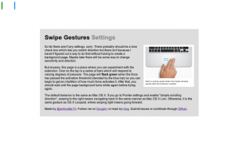

Here's an extension which I actually released[ some time back](https://plus.google.com/116347431032639424492/posts/K4xgL8SKKQU), but never got around to writing a blog post for. Part of the reason was that the early reviews didn't quite pan out, in large part due to _not working_. But I was using my Chromebook and I somehow felt a vague longing for some kind of multitouch gesture, and remembered that I had made this little extension (which I had disabled for some reason). Anyway, this is as appropriate a time as any to formally announce it to my probably remarkably small blog readership.

There is, however a tad bit of difficulty representing the function of it in pictures because really, it doesn't have a big UI. It makes hardware more useful, and in its idealized form, should have no interface. But of course, we don't live in a place where apps are perfectly idealized and either way, Apple has [plenty of nice pretty pictures](http://www.apple.com/osx/what-is/gestures.html) of people swiping fingers to the right.

I really fell in love with the Macbook multitouch gestures, almost at first sight. They just seemed so natural and so beautiful that I sort of felt that that was like the epitome of design or HCI perfection. And from that point, any time I used a laptop which wasn't made by Apple (or even the ones which were made by Apple but were stuck in the barbaric ages preceding the inclusion of the glass multitouch pad, where its invention might have produced a [scene like this](http://en.wikipedia.org/wiki/File:Creaci%C3%B3n_de_Ad%C3%A1n.jpg)), I felt thoroughly disgusted.

Flipping through the Chromium OS design papers, there is one page dedicated specifically to[ cool multitouch gestures](http://dev.chromium.org/user-experience/multitouch) which could be used. And as far as I'm aware the Samsung Series 5 550 (the new chromebook) is the only device which supports these gestures (thus far), and even then it's only pinch to zoom and forward/back (three finger). All the other Chromebook users have been left out.

Another cool thing about the implementation is that it uses a certain `webkitDirectionInvertedFromDevice` property of the `mousewheel` events, which gives you a boolean value about whether or not the platform you're on has some magical direction inversion like on OS X Lion or if you've enabled "simple scrolling" on Chrome OS. But this might not have been a good idea since swipe directions too are sort of inverted on those platforms naturally as well, so it might be better to _not _compensate for it.

Anyway, the implementation is actually quite simple. The current version doesn't even break the 40 line mark, because all it does it it listens for `mousewheel` events on every page (via a content script), and it calculates the current acceleration. If that acceleration ever passes a certain threshold, it triggers a forward or back action. Right now, the threshold is preconfigured based on my own testing on a Samsung Series 5 (note, not 550) chromebook. But for people with other devices, I'm working on a second version which will be slightly more Apple-esque in its implementation.
