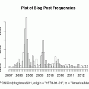

This post has been hinted at by the past few blog posts, but I guess eventually it has to be written. But the basic gist is that rather than making this the home of random announcements of mostly finished projects, it'll be the home of mostly daily (or weekly, whenever significant progress is made) and probably shorter updates on the progress certain projects. That is, the blog is transitioning back into something more like the olden days (circa 2008-ish) but without falling into the trap of using this as an alternative to having commit messages and still supporting the fact I'm now working on quite a bit more than one project at a time.

The problem is that I can't exactly stay true to that because I actually have quite a bit of backlog in terms of stuff I have to write about, stuff which is for the most part done (so it's not particularly viable for me to make up progress updates retroactively, and I'll probably have to stick with writing a big blog post about it).

This should be the culmination of tons of factors and trends building up for the past year or so. I've always felt that the blog needed to be overhauled eventually (or end up rotting as nothing more than a backup kept in the eternal resting spot which is the Internet Archive, leaching fluids into the soil as bacterium leave the corpse punctured by holes and missing vital organs, a sure sign that I'm probably going too far into this metaphor, but in the end that's the way many of the forums I used to visit have become). But the real spark came in the form of a migration to a new web host, something which I still alas have yet to blog about despite it happening over a week ago.

Those changes are hardly precipitous (however much anyone wants to unveil something in one flash of an instant in order to feign the appearance that everything happened suddenly and approached new heights of grandeur, that never actually happens, and it's simply harder to work in that sort of manner - slow and steady doesn't always lose the race). The first part was the change of the web host itself which was actually not exactly planned (I was testing out it, and unexpectedly on a whim cancelled my old web host and migrated over over the course of an afternoon and left the site down for a few hours). The second front at which this evolution occurred was a slight redesign, changing the color scheme a bit, upgrading the theme, reorganizing the categories and menus (this is meant to be chronicled in detail in some other blog post which I have yet to written). And the third and last one (which was meant to be the topic of this blog post) is a change in content.

In summary, three inevitable changes on three different fronts. Content, Frontend, and Backend. All in a not-so-grand gesture to save this blog from decaying into a moldy blob of feces on the internet's great sidewalk.
