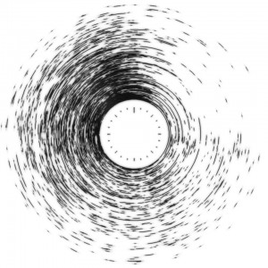

You might have noticed that I haven't written much for this blog in the past few months. In truth, it's because of school work, which has never really been something of an issue before. This is, quite probably the least productive stretch of time in my life thus far. I have a suspicion that this issue stems more psychologically than due to some radical increase in work load, but I haven't looked in to testing that hypothesis (I've been collecting data hour-by-hour about what I've been doing in the past two years, so I could probably look into it if I were actually interested in that matter). But school's nearing a close, and hopefully I can get back to a more productive lifestyle, maintaining my blog and most importantly, trying out cool things. I have a few things which I am working on at the moment which should be completed in the coming weeks (though I make no assurances). But since I have an internal goal for writing one blog post per month, I'm going to recycle a project from December of 2011.

Nearly every day, I inevitably end up glancing at my Facebook "buddy list" of sorts, wondering how many people are online. It's a figure which almost always seems to depend on the time of day, and behaves almost like clockwork, there's always a massive swarm of people online around 10-11pm, and hardly anyone is ever online at 4 in the morning. I guess the problem with drawing any conclusions from this in particular is how specific a group this graphic represents. It constitutes my friends, and in particular, my Facebook friends. Essentially all of them are people I've encountered in real life, and may or may not actually find interest in. But the thing that unites just about everyone is that they're generally high school aged.

Before going on discussing how pretty of a chart this is, I think it's worth going through what this chart actually represents. It's quite easy to tell that this is in fact a polar chart, and on the inner circle, you can tell that it's a 24 hour clock. Each of the rings represents a friend, and the rings are sorted by the total amount of time spent on Facebook in the given period. So you can see that toward the middle, the graph is almost opaque at every time, whereas on the fringes, the online activity is quite erratic and infrequent.

So, where does this data come from? It's actually quite simple to get from the Facebook API. I have a cron job which runs every minute to run a FQL request and save the results to a specific log file.

The actual FQL which runs in order to retrieve the list of online users is

> SELECT uid, name, online_presence FROM user  WHERE online_presence IN ('active', 'idle') AND uid IN (SELECT uid2 FROM friend WHERE uid1 = me())

Basically, get the User ID, the name, and their online presence state for friends who are either active or idle in the list of the logged-in user. Since Facebook is an OAuth2-type API, you need an access token in order to do anything cool. I just use the [Facebook Graph API Explorer](https://developers.facebook.com/tools/explorer/145634995501895/?method=GET&path=1686802955) to generate my access tokens. Just go press "Get Access Token", and select (at minimum) the permissions "user_online_presence", "friends_online_presence" and "offline_access". Then copy and paste the revealed token into some <tt>authkey.txt</tt> and you should be set.

I have a python script to go through the log file and to render it as the polar chart which is depicted on the top of the page. The code used for that is frankly atrocious and the output is even more so. Python Imaging Library is used, which is a lovely library, except not for drawing graphics. There isn't any smoothing or anti-aliasing on the arcs drawn by PIL and they all look hideous. So I render the chart at some absurdly high resolution and down-resize it in GIMP while adding layering, blurs and opacity in order to make the picture somewhat less atrocious. Also, it does't support restricting the app to drawing a specific day of the week, even though it might be interesting to see the how the trend differs on a weekday versus weekend.

Something interesting about the appearance of the polar graph is that it almost resembles something of a digital fingerprint, and that brings up some interesting privacy considerations. Inside that graphic are the Facebook browsing habits of some two hundred people. There's the question of how much this changes day by day for users, and to what extent this can be used to identify people. And even if a single ring doesn't unambiguously represent a single person, the two hundred or so rings of their friends probably goes pretty far into identifying people. There's also a striking amount of uniformity that says a lot about the type of people who I tend to associate with. Just at a glance, one can tell that there are very few people I'm friends with on Facebook who live in different timezones. Maybe what's more dangerous than being able to identify a person is to be able to identify what kind of groups that person belongs to. And over the course of a day, just about everyone checks Facebook a few times. 
