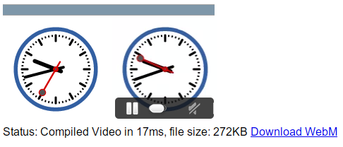

This is sort of a conceptual reversal (or not, this might just be making the description needlessly confusing) of one of my older projects,[Weppy](https://github.com/antimatter15/weppy). First, what Weppy did was it added support for WebP in browsers which didn't support it by converting it into a single-frame video. This is instead predicated on the assumption that the browser already has support for WebP (at this point, it means it only works on Chrome since it's the only browser which actually supports WebP), not only decoding WebP but encoding it as well.

The cool thing about WebP which was exploited in Weppy is that it's actually based on the same codec as WebM, On2's VP8\. That means the actual image data, when the container formats are ignored, are virtually interchangable. With a catch: it's intraframe only.

So it's a video encoder in that it generates `.webm` files which should play in just about any program or device which supports the WebM format. But interframe compression is actually a fairly important thing which could reduce the file size by an order of magnitude or more.

But, there isn't too much you can do on the client side in the ways of encoding stuff. And whatever you do, you basically can't do interframe compression (aside from some really rudimentary delta encoding). More or less, when your only alternative is to maintain an array of DataURL encoded frames or encoding it (rather slowly) as a [GIF](https://github.com/antimatter15/jsgif), a fast but inefficient WebM encoder stops looking too bad.

This was actually [Kevin Geng](https://github.com/gengkev)'s idea, and he contributed some code too, but in the end most of the code was just leftovers from Weppy.

## Demo

[http://antimatter15.github.com/whammy/clock.html](http://antimatter15.github.com/whammy/clock.html)

## Basic Usage

First, let's include the JS file. It's self contained and basically namespaced, which is pretty good I guess. And it's not too big, minified it's only about 4KB and gzipped, it's under 2KB. That's like really really tiny.

    

The API isn't terrible either (at least, that's what I'd like to hope)

    var encoder = new Whammy.Video(15); 

That `15` over there is the frame rate. There's a way to set the individual duration of each frame manually, but you can look in the code for that.

    encoder.add(context or canvas or dataURL); 

Here, you can add a frame, this happens fairly quickly because basically all it's doing is running `.toDataURL()` on the canvas (which isn't exactly a speed-demon either, but it's acceptable enough most of the time) and plopping the result onto an array (no computation or anything). The actual encoding only happens when you call `.compile()`

    var output = encoder.compile(); 

Here, output is set to a Blob. In order to get a nice URL which you can use to stick in a `&lt;video&gt;` element, you need to send it over to`createObjectURL`

    var url = (window.webkitURL || window.URL).createObjectURL(output); 

And you're done. Awesome.

## Documentation

`Weppy.fromImageArray(image[], fps)` this is a simple function that takes a list of DataURL encoded frames and returns a WebM video. Note that the images have to all be encoded with WebP.

`new Weppy.Video(optional fps, optional quality)` this is the constructor for the main API. quality only applies if you're sending in contexts or canvas objects and doesn't matter if you're sending in encoded stuff

`.add(canvas or context or dataURL, optional duration)` if fps isn't specified in the constructor, you can stick a duration (in milliseconds) here.

## Todo

This pretty much works as well as it possibly could at this point. Maybe one day it should support WebWorkers or something, but unlike the GIF Encoder, it doesn't actually require much real computation. So doing that probably wouldn't net any performance benefits, especially since it can stitch together a 120-frame animation in like 20 milliseconds already.

But one of the sad things about it is that now it uses Blobs instead of strings, which is great and all except that blobs are actually slower than strings because it still has to do the DataURL conversion from string to Blob. That's pretty lame. Firefox supports the canvas toBlob thing, but for some reason Chrome doesn't, but eventually it probably might, and that might be useful to add.

Also, if someone ever makes a Javascript Vorbis encoder, it would be nice to integrate that in, since this currently only does the video part, but audio's also a pretty big part.
