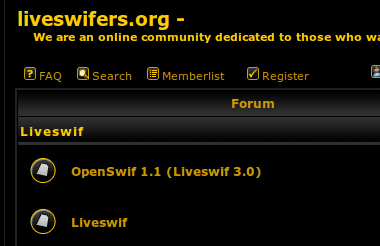

I first registered an account on liveswifers.org on December 11th, 2006\. I was 11 years old at the time. It was this time when the Ajax Animator began. I'm not sure of that, because 5 years past certainly constitutes ancient history for a teenager. It was a huge influence on the development of the Ajax Animator, and it was there that I first encountered some of the future contributors to the project. In fact, the community was kind enough to create an entire subsection of the forum intended to nurture discussion of my pet project, which paralleled their eternal vaporware attempt at resurrecting their namesake program.

Over the next few years, the community decayed and the site became desolate and spam-ridden. There was a period in late 2008 when every indication was that the site would come to an abrupt demise when the domain registration was to expire. The still active community created a backup community on some other forum hosting site and prepared for the worst. I did my part by running WinHTTrack and mirroring the site on my hard disk. It turned out the domain was renewed, and the panic was for nought.

But, when the website finally became a desolate and abandoned wasteland a few years later, the domain lapsed and all the content was lost.

In a nostalgic fit earlier today, I dug up that archive and uploaded it to Google Code. [Here you can browse the near entirety](http://forkswif.googlecode.com/git/Liveswifers/www.pryjon.com/liveswifers/forums/index-2.html) of the liveswifers forum as it was, frozen in carbonite those three years ago. I can't place that date, December, 2006 quite in context, but I would expect that to be approximately the date that the seeds of inspiration were planted. And so maybe not for anyone else, but this site and all its content holds a special place in my mind, and deserves a final resting place shielded from the harsh internet.
