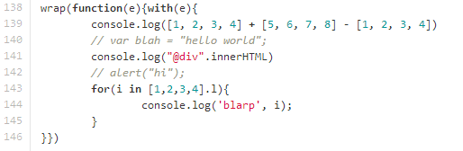

It's times like these that I'm reminded of my favorite childhood TV show (actually it's kind of a close contest between this and Spongebob), Mythbusters, and that perennial warning: "don't try this at home". But this isn't actually dangerous in any physically life-damaging way, it's just dangerous in that it's a very bad idea. The whole thing started with a friend who was irked by a few Javascript oddities, one of them being the inability for arrays or tuples of numbers to add.

I actually came across an idea some time ago while reading about [cross-site JSON exploits](http://jeremiahgrossman.blogspot.com/2006/01/advanced-web-attack-techniques-using.html). But the premise for adding arrays is rather simple: since the language only supports subtracting and adding numbers, the javascript engine will try to convert an array to a number by calling its valueOf method. There really isn't a numeric representation of an array so valueOf usually just returns <tt>NaN</tt>, which isn't tremendously useful. However, we can override the valueOf function to return any number we want.

We can create a <tt>valueOf</tt> function which assigns numbers to arrays according to a specific pattern, such that the resultant number can reveal (without much ambiguity) which arrays were involved, and whether they were added or subtracted. There are probably a myriad of ways to construct numbers like that, but one of the simplest (or at least the first one that I could come up with) is to raise some given radix (at least 3) to a unique number that increments every time valueOf is called. You can understand it pretty simply in base 10.

Lets say our first array is <tt>[1, 2, 3]</tt>  and our second array is <tt>[5, 4, 3]</tt>. Every time the instance's <tt>valueOf</tt> is called, we plop it onto a temporary global array and record the index. In this case, lets assign the first array index 1, and the second array index 2\. If we raise the radix 10 to that index, we can get the respective unique numbers: 10 and 100\.  Now these numbers can be added or subtracted, leading to 110 or 90 or -90 (or unaltered, leaving 10 and 100). To find out what operations and what numbers are involved in the operation, we can first add 1000 which is 10 raised to the size of the global array, which has the useful effect of making everything positive. Now we're left with <tt>1110</tt>, <tt>1090</tt>, <tt>0910</tt>, <tt>1010</tt>, and <tt>1100</tt>. We can ignore the first and last digits, and each digit can be either a 1, a 0 or a 9 (if it's anything else, this is just a number, not the result of a magical array addition). A 1 tells us the number was added, a 0 tells us the number isn't used, and a 9 tells us that the number was subtracted.

This leaves a weird problem though, which is how you're going to convert a number back into that array transparently. And this segues into the more atrocious segment of this hack. If and when Skynet and the other assorted malevolent (uh... I mean, _misunderstood_) artificial intelligences develop their courts, the fembots and gentledroids of the jury will no doubt consider me guilty of whatever felonious usercrimes may exist. They'll consider me an equal of [Norman Bytes](http://en.wikipedia.org/wiki/Norman_Bates), butchering idiomatic javascript in the shower.

What exactly makes it such a heinous offence, you may find yourself asking. The answer is simple: the unholy matrimony of <tt>with</tt> and <tt>Object.defineProperty</tt> (also, keep in mind that it isn't DOMA's fault).

The great thing about Object.defineProperty is that it lets you get in the middle of the whole variable assignment process. The problem is that this only works with object properties, not top level variables. But Javascript has a nice (read: wretched) <tt>with</tt> statement which lets you treat variables as if they were object properties. This still leaves a slight problem because there's no way to define a catch-all property. And if nothing so far has wrought utter terror to your soul, this last critical part may very well do exactly that. Since variables that are called must exist there in name, we can use the Function <tt>toString</tt> method to decompile the source and use a simple regular expression (any symbol which starts with A-z $ or _ followed by any of that or a number) to extract candidate variable tokens, and for each one, we can define a getter and setter on a new object which is subsequently passed as the first argument to the function whose first enclosed statement is a <tt>with</tt>.

The power of intercepting all function calls, variable declarations and retrievals then comes by recursively creating another fake object filled with getters and setters whenever a property is accessed. For method calls to primitive types like strings and numbers, we do the same type of sorcery but directly on their respective <tt>prototype</tt> properties. Whenever a function is passed a number which happens to match the pattern for an array addition or subtraction, we can passively intercept and substitute its value. Any string which matches a certain pattern of CSS selectors can be then transparently substituted with the NodeList which results from a <tt>document.querySelectorAll</tt>. And we can change all the variable declarations for a for..in loop such that array values are used instead of keys.

And now, four minutes before the end of this month, I've successfully yet again managed to eke out a blog post to fulfill my quota. And I guess I don't have an Humane Society to prove that no humans were harmed in the making of this blog post, but how bad could it possibly be-- it's only [150 lines](https://github.com/antimatter15/mathemath.js/blob/master/test.js).
