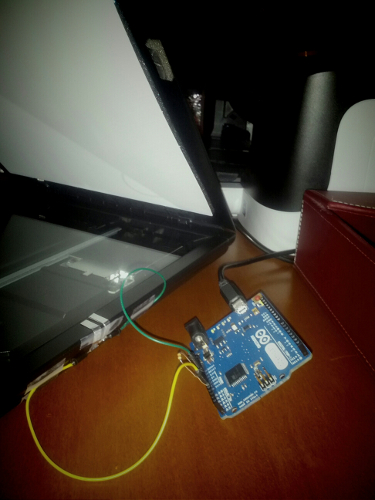

Before the 29th of January, I had a rather irritatingly Rube Goldberigan scheme for using my CanoScan LiDE 80\. It didn't have native Linux support, so the only way I could scan documents was through a Windows XP (Technically MicroXP) installation inside a VMWare virtual machine extant for the sole purpose of indulging my blue moon scanning requirements. But after that fateful day, I had a new scanner which- in its matte black glory could reasonably produce bitmap reproductions from pieces of paper on its surface, notably sans the convoluted meta-computing.

Ubuntu ships with a nice Simple Scan app, which as the name might suggest, allows you to scan things rather simply. But for some reason I thought that getting a scanner was a good reason to start scanning every one of the numerous pieces of paper I get from school. Naturally, there's a problem of course which arises from the fact that I have to open up an app (usually with the absurdly slow unity launcher) and then use my mouse to click buttons, all of which happens on top of the already undue burden of opening the scanner lid to put papers inside.

Obviously this system would be untenable for a mass scanning addiction. Maybe a reasonable person would at that point take a deep introspective about the end goal of such an endeavor. Maybe wasting the 5 Gigabytes a year needed to archive some 8,000 school papers (assuming that the files are stored at a fairly reasonable 200dpi as jpegs averaging around 5MB per)- most of which illegible chickenscratch anyway, plus the ten minutes or so per day at minimum to shuffle papers around. Well, a _reasonable _person would take into account the cost and relative benefit of such a scheme and decide that this really isn't worth it.

But of course, I couldn't be so overtly dismissive if I had that same reasonable sense. Obviously this setback was not a serendipitous invitation from providence to investigate the social, ethical and utilitarian merits of the goal (I say this of course with a great deal of sarcasm, but there are many less trivial opportunities that technologists ignore). Instead, ignoring whether or not it was a good idea in the first place, I decided to fix it.

The first step was trying to get the buttons to work. Canon scanners, and presumably all other scanners, have little buttons on the device that you can push to accomplish certain easy tasks. On Windows, it's pretty cool because it'll automatically launch whatever app it is that scans things and start it automatically. There's a set of four: PDF, Auto, Copy and Email, pretty self explanatory at that (and if that fails to suffice, they're coupled with cute monochrome icons).

The problem is that it doesn't work automagically, at least on Linux. I found  little project called scanbuttond, or something to that effect, and tried patching it in some way that would fix it, but after investing an hour or so- I pretty much gave up.

The thing is that having button isn't even the most efficient system for document scanning. So what physical cues are there to indicate intent-to-scan? The first and most obvious one is the presence of a document in the bay. It's a bit difficult to divine when a document is placed on the surface, though it's probably possible with some fancy arrangement of lasers or light sensors exploiting ftir or precisely measuring the weight of the entire scanner or monitoring the butterflies in proximity for fft'd wing flaps. Plus, chances are that immediately after a document's been placed, you probably want some time to adjust the paper's alignment and get your fingers off the paper (before the intense searing beam of panchromatic LED light reduces your fingertips to burnt crisps).

For flat documents, most of the time when that happens, you close the lid so that the foam white lid insert will press down on the document (flattening out the wrinkles endemic to a haphazard backpack-paper-shoving technique) after making adjustments to ensure proper alignment. The only problem with this scheme is if you're scanning some thicker document (a book- whatever that is) or don't feel like lowering the lid (now, why would you want to do that?).

So with a piece of folded up aluminum foil and foam and some judicious application of tape (in a setup eerily similar to that door alarm that I built from a kit from the Discovery Channel store when I was 7) I crafted a little switch mechanism that activated whenever the lid was closed. Then the two prongs of the foam switch were attached to a voltage divider on and Arduino Leonardo board so that it could measure when the thing closed or opened. A tiny piece of code ran on the Arduino which would do exponential smoothing on the voltage between the pins and send a signal over serial.

On the computer-side of things, there's a little python script which listens on the serial device for whenever the lid has closed. It uses the pySANE bindings to scan the document and then using PIL compares it to a blank scan in order to figure out if what we scanned was actually empty. If it isn't empty, then it saves it to the disk as a file named after the current date.

Twenty lines of Arduino C, and a hundred of Python later, I have a scanner which makes it exceedingly easy to digitize my paper trail. Too bad I haven't used it in four months. I reinstalled Ubuntu at some point and never quite bothered setting it up again (even though it would only entail like two lines to attach it to the startup applications list). Even when it was working, it took some amount of work and offered almost no immediate benefit- it didn't integrate any form of OCR or fancy visualization which could potentially make this interesting from a scientific perspective. But school is winding down, I mean literally graduation is a smidgen more than a week away, so I'm not exactly going to have much more paper to digitize. So I guess this marks the end of a failed experiment, the pre and post mortem- interesting in that it succeeds in just about everything I set out to do, but I never quite got it into _using_ it.

Maybe [you'll find it more useful](https://github.com/antimatter15/scan) than I did.
