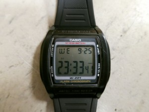
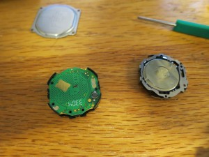

For the past four years, I've been using a Casio W-201 watch. It's plastic and cheap and light, and there isn't really much more I would ask for. I presume Douglas Adams would be rather disappointed by my fondness of digital watches, but I'm frankly just not smart enough to read an analog dial. I haven't migrated to those fancy-schmancy smartwatches, and I don't currently have any intention to part with my precious ticky thingy.

What's ironic is that the one thing that annoys me about this watch is that sometimes it does, in fact, "tick". It beeps, with the shrill piezoelectric sound that plagues anything with a four cent PCB. Whenever I switch its mode from military time to regular, or from clockface to stopwatch, I'm greeted by that hundred millisecond reminder that I have ears. And out of some odd sense of courtesy, or deep desire to be unnoticed, this really bothers me.

I may have been a tad disingenuous in saying that I've used the same watch for the past four years. Some time in the beginning of the span, I managed to lose my watch, and bought an exact replica. Well, it wasn't quite the exact replica. The watch had the same model number, but the band that bore the Casio emblem seemed a different hue. Most irritatingly though, this replica made noises when the old one didn't. At first I thought this was an edgy new feature that made things feel more responsive and tactile, but eventually I realized it was actually pretty annoying.

I distinctly recall the birth of a conspiracy- my subconscious irritation was percolating through neural pathways, assembling a notorious scheme to administer open-heart surgery on this diminutive timepiece to euthanize the noise, once and for all, under the noxious smother of a lead-tin alloy. But these fugitive fermentation of my mind took a backseat when I found my formerly missing watch limply lying on the edge of a basement table.

About a month ago, I had found myself in similar shoes. I had come onto campus with the sudden realization that my precious chronometer had vanished. I scoured the depths of the two pockets in my rather minimal backpack (I decided to pack light for senior year after lugging a monstrosity of a backpack for all of 11th grade), yet no plastic timekeeper was to be found.

Reluctantly, I located my contingency clock, and uneasily slid it onto my left wrist. But soon enough I had felt comfortable in the metaphorical transition of life which the watch represented. It'd be a new phase of my life, running at a different pace, in a new setting- I shouldn't be encumbered by the gadgets of old.

They say all relationships suffer from a kind of honeymoon phase, where everything in the universe seems kept in perfect harmony. I celebrated my watch's inaugural re-synchronization, meticulously ensuring that the deviation from NIST's official US time was no more than a quarter-second. But as all quartz oscillators perceptively drift over time, my  relationship with my lightless-sundial began to sour.

This edgy beeping noise began to perceptively evolve from neat to nuisance, and the long-lost scheme of silence started to surface. The final straw came when I had acquired a nifty petite set of mini-screwdrivers, ostensibly for eye-glass repair, courtesy of State Farm at the Career Fair. A particularly intractable case of post-midnight procrastination inevitably struck, leaving a desk strewn with digital watch-guts in its wake.

As I fumbled with how to trigger the precise reset code needed to get the watch to emerge from its disassembly-induced coma, I kept trying different permutations fitting some little spring in every nook and cranny I could find within the interior of the watch. As I haphazardly reassembled the watch, I noticed that the noise was gone, well, a rather significant caveat was that the screen would go black and the device would reset on every light flick of my wrist. From that, I realized that the spring must have been the connection between the ground and the piezoelectric buzzer- silencing the noise would be as simple as taking it out of the watch, rather than shoving it on top of the reset contact.

And as I began to appreciate the magnitude, or lack thereof, of insight gleaned from that epiphany, I came to realize the more protracted history of my first watch. When I had previously changed the battery on the original watch, I must have accidentally knocked out the most minuscule of springs, and simply overwritten the memories of the beep beforehand.

After all this time, the only thing that I had really wanted was to break something in the same way I had so many years prior. And I guess I might as well note as an epilogue that I found my original watch shortly thereafter while rifling through some cabinets. But I've embraced this new watch and all it symbolizes, perhaps ironically by physically handicapping it into the old one.
