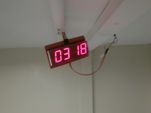

If the frequency of these progress reports is to say anything, it's that I'm terrible at sticking to a schedule and even worse at estimating progress. I was hoping that I'd be able to use the Thanksgiving break in order to be productive and get ahead of my various projects– in particular, getting the text-detection and OCR extension to a state complete enough to publish.

For the past few days I've been playing with writing a minimal cryptocurrency which incorporates the central innovation of Bitcoin— the hashcash based transaction chain. It's a simple enough concept that I could manage to implement the core functionality in about a hundred lines of Coffeescript.

I'm also working on a cute little alarm clock which incorporates a pressure sensor underneath my bed in lieu of a snooze button. The goal is to use it as a framework for novel approaches to the tried and true problem of getting undergrads to wake up at ungodly hours (anything before noon). It's powered by an Arduino and I2C ChronoDot and a large 7-segment display.

I've laid a little ethernet cable from the side of my bed, along the ceiling and to the door which contains a bunch of little EL wire inverter boxes (I'm smothering the transformers with Sugru in order to hopefully dampen the onset of my acoustically-induced insanity).
