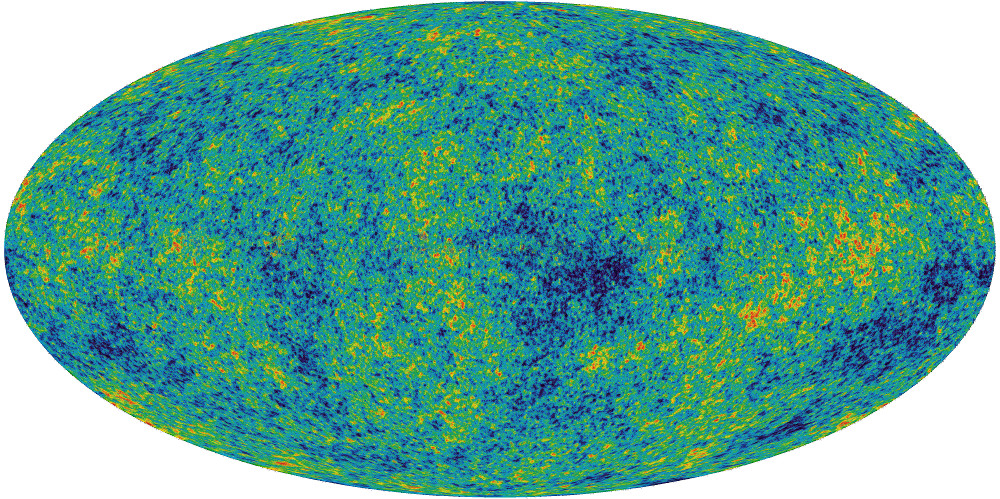
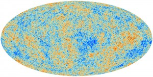
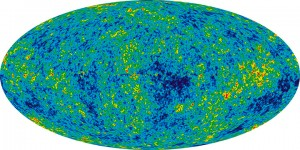

The rationale behind this is actually pretty contrived, but one of my friends had an imminent birthday, and I had no idea what kind of present to get her. Incidentally she sent had been working on some project and sent me a copy to look over- a request that I honored by perpetually promising to get to it _eventually_. Sure, it was interesting enough, but several months elapsed and I was beginning to face the fact that I would in all likelihood never actually get to it (kind of like my bottomless Instapaper queue from three years ago)- but that resounding guilt instilled the notion that somehow she liked astrophysics (the paper was something on [Perlmutter's Nobe](http://www.nobelprize.org/nobel_prizes/physics/laureates/2011/)l). So in the absence of any other good ideas, I decided to get her a giant printout of the classic WMAP CMBR.

Soon after finding a poster for sale off [Zazzle ](http://www.zazzle.com/)entitled the "[Face of God](http://www.zazzle.com/face_of_god_poster-228261263707923223)" (a particularly poetic pantheistic epithet), I found out that only a week earlier the European Space Agency had published the results of their [Planck probe](http://apod.nasa.gov/apod/image/1303/)- a substantially higher quality rendition of the cosmic microwave background. So the solution would be simple, I'd just take that new, clearer image and upload it to that poster-printer under some clever title like "Face of God- [Dove Real Beauty](http://www.youtube.com/watch?v=XpaOjMXyJGk)TM", as if the NASA's WMAP is some kind of odd [gaussian girl trope](http://tvtropes.org/pmwiki/pmwiki.php/Main/GaussianGirl).

But the ESA's Planck coloring is for some unfathomable reason particularly ugly. Sure it has a kind of crude appeal reminiscent of some kind of yellowed 14th century cartographic map with its tan speckled shades of color, but in general, it's just kind of ugly. Maybe it's [five hundred million years of evolution](http://en.wikipedia.org/wiki/Evolution_of_the_eye) that makes me particularly predisposed to the blue-green aesthetic of leafy flora and the azure sky. Also, for sake of recognizability, the WMAP data has made its fame with that _particular_ coloring, it's kind of unreasonable to expect someone to recognize it even after the color scheme has been changed.

The task of recoloring it was actually pretty simple, I just had to locate a legend for the respective graphs- a solid gradient which spans from the cool side to the warm side (the actual range of the data is only ±2mK so there isn't in this case a massive difference between cool and warm). After crawling through a handful of scientific publications, it's easy enough to find one and take a screenshot.

The difference in width is actually a kind of useless distinction, an artifact of the resolution of the paper or image I extracted the gradient from. It's kind of interesting because I don't really have any idea what the mathematical basis of these gradients are. The WMAP one looks like a simple rainbow so it may just be the colors arranged in progressively increasing wavelength, while the ESA coloring appears to be some kind of linear interpolation between red, white and blue (if the nationalities were inverted, one might be tempted to say murrica).

But once the gradient is established, it becomes the trivial task of mapping the colors of one image to another, something that I kind of hackedly accomplished with a Python script using PIL (It took a minute or so to process the 8 million pixels, but that's not really too bad). And then, because the ultimate purpose of my project wasn't so much to attain scientific accuracy as feigning it with some kind of better aesthetic, I went to GIMP and superimposed a translucent copy of the WMAP data so the image isn't quite so speckled and the larger continental blobs more apparent.

[Here is the poster](http://www.zazzle.com/recolored_planck_cmbr-228277903548974917) if you want it. And [the resulting 6.1MB jpeg](iCgy2H2o85YEQ.jpg).
