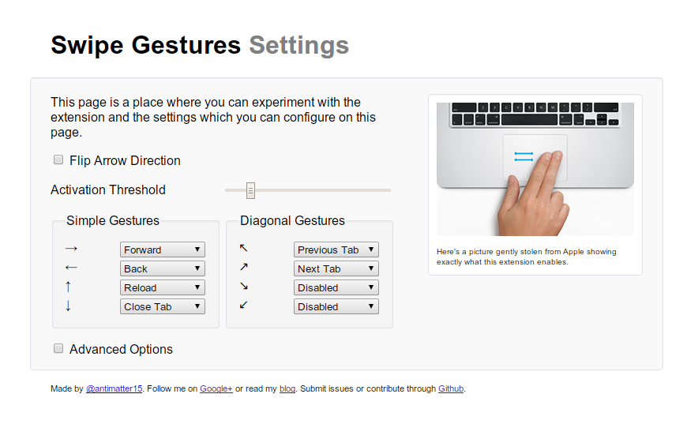

I've actually had this post fermenting in my blog's draft folder since at least September, but I never actually got around to finishing the post. And now that Google's enabling the new swipe-to-go-back by default on the dev channel versions of Chrome OS, it finally feels like the right time to post. As in, I feel like posting things right when they're soon to be absolutely useless (Which, you might recall, was the case with my Google Wave client, which started selling on the App Store the day Google announced that Wave would be phased out and eventually shut down).

So, a few months ago, I finished my update to the[ Swipe Gesture ](https://chrome.google.com/webstore/detail/swipe-gesture/mgegfjnccpnkdppohmfgnjalkediapkc?hl=en-US)extension, which featured a rather significant redesign. It supported multiple gesture directions and a fancy animated element to indicate the direction of the gesture.
