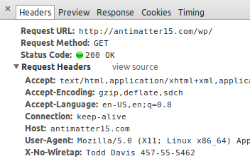

Recently, the American public has been [forcefully made aware](http://www.theguardian.com/world/prism) of the existence of various programs by the NSA- including massive infrastructure for intercepting all domestically routed communications to better protect us from imminent foreign threats. With legions of patriotic analysts, the NSA methodically ranks communications on the basis of their "[foreignness](http://www.slate.com/blogs/future_tense/2013/06/06/nsa_prism_surveillance_private_data_from_google_microsoft_skype_apple_yahoo.html)" factor to determine candidacy for prolonged retention. Although it was developed with the best interests of the American people at heart, this program [unwittingly](http://www.washingtonpost.com/blogs/fact-checker/post/james-clappers-least-untruthful-statement-to-the-senate/2013/06/11/e50677a8-d2d8-11e2-a73e-826d299ff459_blog.html) ensnares communications of purely domestic nature on the order of tens of thousands of incidents per day. These innocent mistakes are putting the agency at a great risk because the 4th Amendment of the Constitution expressly prohibits such affronts to American privacy. Making determinations of foreignness is hard, but to prevent further inconvenience to the American way of life, we should take these leaks as an opportunity for us on the civilian front to aid the NSA by voluntarily indicating citizenship on all our networked communications.

Here, we define the syntax and semantics of X-No-Wiretap, a HTTP header-based mechanism for indicating and proving citizenship to well-intentioned man-in-the-middle parties. It is inspired by the enormously successful [RFC 3514](http://tools.ietf.org/html/rfc3514) IPv4 Security Flag and HTTP [DNT header](http://tools.ietf.org/html/draft-mayer-do-not-track-00).

## Syntax

The HTTP header, "X-No-Wiretap" takes the value of the current user's given name under penalty of perjury. The full name must be immediately followed by identity verification in the form of a standard [U.S. Social Security Number](http://en.wikipedia.org/wiki/Social_security_number), formatted with a hyphen "-" after every third and fifth digit.

Future revisions of the protocol may introduce additional forms of verification, as while the presence of an SSN should be able to lower the foreignness coefficient of the vast majority of domestic communications to well below 51%- initial research seems to indicate that the combination of full first name and SSN is able to reduce an associated message's foreignness factor by over 76.8% for 99.997% of Americans. However, there is a chance that certain instances may additional require Passport, Driver's License, Address, Birthdate, Mother's Maiden Name, and Childhood Best Friend's Name to further lower the foreignness factor. This capability will be addressed in future versions of the protocol.

## What about SSL/TLS?

Of course adding encryption makes it substantially more difficult for the NSA to interpret the content of what a user is sending, and increases the chance that they may unwittingly collect and retain your communications. In order to address these concerns, this proposal necessarily deprecates all the SSL/TLS ciphers in favor of Double [CAESAR'13](http://en.wikipedia.org/wiki/ROT13), a thoroughly studied and well-known military-grade solution which offers excellent modes for graceful redegradation.

## Isn't it dangerous to send your social security number in plaintext along with every request?

Conventional security warns of the possibility of [man-in-the-middle attacks](http://en.wikipedia.org/wiki/Man-in-the-middle_attack), but these new intelligence revelations require entirely new types of cryptographic thinking. Here, the trusted entity is not the server acting at one end, it's not even the user issuing the requests- but rather, it's the bureaucracy sitting in the middle politely intercepting all traffic for benevolent analysis- protecting your way of life.

One may be tempted to characterize this as a sacrifice of privacy in order to optimize security, but this position is simply naive. Every new progressive initiative of the government advances both fronts- both security and liberty, never at the expense of either. If you take a holistic long term perspective on the impact on a global scale with a vast array of (classified) information sources, there is very little question that you too would arrive at the same conclusions on the genuine merits of this surveillance system.

In this case, the removal of encryption ensures that the government is able to parse the content of messages to identify terrorists. At the same time, the inclusion of the citizenship identification information should give citizens the safety of mind, knowing that their messages will not be stored indefinitely in a NSA datacenter.

## What about Identity Theft?

> What if you set up a server to transparently capture the browser headers? Any malicious entity could then collect all the social security numbers and real identities of everyone who happened to stumble onto their websites and use the information to sign up for credit cards, create hazardous investments, threaten or blackmail loved ones, and masquerade as a citizen while doing terrorist activities!
> 
> 
> There isn't any _real_ evidence that such sweeping surveillance will even substantially reduce the chances of events that are intrinsically outliers anyway. On the other hand, [identity theft is a real world issue](http://www.wired.com/threatlevel/2010/05/lifelock-identity-theft/) which affects millions of Americans on a daily basis- and these changes will only make our _real_ problems worse.
> 
> 
> — _Short-Sighted Critic_
Our government has to reconcile with the fact that the flow of information has radically shifted in the past few decades- all the previous paradigms of privacy, security and adversaries have been obsoleted. Understandably, they need to create infrastructure to tackle this next generation of attacks. This could mean highly orchestrated attacks being planned online, and the government is justified in trying to exercise every available option to avert the next cyber-9/11\. Our adversaries may have no limits to their capabilities, and so waiting for definitive evidence on the efficacy of counter-intelligence approaches is giving them an opportunity to plan their next attack.

When what's at stake is the American way of life, it's easy to put aside things that don't really matter.

If the terrorists do find a way to cheat the foreignness heuristic, that's not a problem, because this proposal is backwards compatible with the existing catch-all NSA policy. They can always, in the end, ignore the X-No-Wiretap header, but we wouldn't know so it'd be okay.

## When can I use this?

It's expected that this proposal will breeze through the standardization process- because we as Americans can always get together and do that which must be done in these times which [try men's souls](http://en.wikipedia.org/wiki/The_American_Crisis). Browsers should implement the feature as soon as possible, so that people can make use of the increased sense of security and privacy it affords.

If you're truly eager to try it out, you can contribute to the prototype [chrome extension](https://github.com/antimatter15/x-no-wiretap) which supports the header injection (the reversal of HTTPS Everywhere, a feature called HTTPS Nowhere hasn't been implemented yet, but we're accepting pull requests!). Since this extension is still experimental, inserting your personal identifiable information must be done by editing the source code, but you should expect a more user friendly interface in the next revision. Since it isn't thoroughly tested, there may be a chance that it fails to leak the user's personally identifiable information with every networked request, but rest assured this will be fixed as soon as the bugs are made aware to us.

We should all rally behind this proposal for a simple technical solution which will go a great length to simultaneously enhancing both privacy and security, while overall preserving the only thing which matters, our American way of life.
