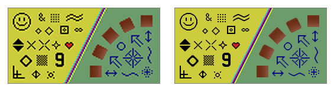

Every once in a while some gadget has the misfortune of epitomizing the next first world problem. I guess right now, this is owning a Retina (or equivalent) laptop, tablet (arguably phone, but most web pages are scaled out so it's not that big of a problem) and being irked at the prevalence of badly scaled graphics. So there's a new buzzword "Retina Ready" for websites, layouts and designs which support higher resolution graphics for devices which support it, often meaning of lots of [new files and new css rules](http://37signals.com/svn/posts/3271-easy-retina-ready-images-using-scss). It's this trend of high-pixel-density devices (with devices like the [iPad 3](http://www.apple.com/ipad/), [Retina Macbook Pro](http://www.apple.com/macbook-pro/), [Nexus 10](http://www.google.com/nexus/10/) and [Chromebook Pixel](http://www.google.com/intl/en/chrome/devices/chromebook-pixel/) - though I for one don't currently have any of them, just this old glitchy-albeit-functional first generation Chromebook) that is [driving people](https://github.com/twitter/bootstrap/pull/6342) to vector [icon fonts](http://fortawesome.github.com/Font-Awesome/).

But the problem of radical increases in terms of resolution isn't a new one. Old [arcade games](http://en.wikipedia.org/wiki/Video_game_arcade_cabinet#Parts_of_an_arcade_cabinet) rarely exceeded 260x315, and the [Game Boy Color](http://en.wikipedia.org/wiki/Game_Boy_Color#Specifications) had a paltry 160x144\. While a few people still nostalgically lug around game cabinets and dig out their dust-covered childhood handheld consoles for nostalgic sneezing fits, most of the old games are now played with emulators running on systems several orders of magnitude more sophisticated in every imaginable aspect. So that arcade monitor that once could engross a childhood (and maybe early manhood) now appears nothing more than a two inch square on a twenty inch monitor. But luckily there is a surprisingly good solution to all of this in the form of algorithms designed in particular for [scaling pixel art](http://en.wikipedia.org/wiki/Image_scaling#Pixel_art_scaling_algorithms).

The most basic form of image scaling that exists is called **nearest-neighbor interpolation**, which is extra simple for retina devices because it means simply growing the size of each pixel by a factor of two along each axis. That leads to things which are blocky, and unless you're part of an 8-bit retro-art project with a chiptune soundtrack looks ugly.

The most common form of image scaling borrows a lot from the math and signal processing fields, with names like **bilinear, bicubic, and lanzcos** essentially they treat an image as some kind of composition of sinusoidal parts and try to ideally extrapolate and interpolate such that visible artifacts are marginalized. It's all very mathy, but the result is kind of the opposite of nearest-neighbor because it has the tendency to make things blurry and fuzzy.

The thing is that the latter tries to reach some kind of mathematical ideal, because images taken by your friendly neighborhood DSLR-toting amateur (spider-powers optional) are actually samples of real world points of data-- so this mathematical pursuit of purity works out very well. There's still the factor-of-four information-theoretic gap that needs to be filled in with best-guesstimates, but there isn't really any way to improve the way a photograph is scaled without using a higher-resolution version of said photograph. But most photographs that are taken already are sixteen-megapixel monsters and they usually still look acceptable when upscaled.

The problem arises with pixel art, little icons or buttons which someone painstakingly drew in Photoshop one lazy summer afternoon in the late 90s. They're everywhere and each pixel isn't captured and encoded by a sampling algorithm of some analog natural phenomona-- each pixel was lovingly crafted and planted by some meticulous artist. There is no underlying analog signal to interpret, it's a direct perceptual hookup to the mind of the creator-- and that's why bicubic sampling looks especially bad here.

Video games, before 3d graphics engines and math-aware anti-aliasing concerned with murdering [jaggies](http://en.wikipedia.org/wiki/Jaggies), in the old civilized age of [bit-blitting](http://en.wikipedia.org/wiki/Bit_blit), were mostly constructed out of pixel art. Each color in that limited palette was placed there for a reason and could be exploited by specialized algorithms to construct higher-quality upscaled versions which remained sharp. These come with the names **EPX, Scale2x, AdvMAME2x, Eagle, 2×Sal, Super <strong>2×Sal,**</strong> **hqx, **and most recently, **Kopf-Lischinksi**. These algorithms could be applied in real time to emulator windows to acceptably scale a game to new sizes while eschewing jagged corners and blurry edges. _
_

Anyway the cool thing is that you can probably apply these algorithms in lieu of the nearest-neighbor or bilinear scaling algorithms used by browsers on retina platforms to effortlessly upgrade old sites to shiny and smooth. With a few rough heuristics (detect if an image appears to be a sprite by testing for a limited palette, see if the image is small or a perfect square, detect if it has transparent pixels) this could be packed into a simple script include that website makers could easily inject into their pages to **automagically upconvert old graphics** to new shiny high-resolution ones without having to go through the actual effort of drawing new high resolution graphics and uploading them online. And this could also be packaged as a browser extension so that, once and forever after, **this first-world nuisance shall be no more**.

_Before setting out to port [hqx-java](https://github.com/Arcnor/hqx-java) to [javascript](https://github.com/antimatter15/hqx.js), I actually did some cursory googling to see if it actually had been done before. Midway through writing this post, I found out that it actually had [been done before](http://phoboslab.org/log/2010/12/hqx-scaling-in-javascript), in a better way, so I won't even bother linking to my inferior version. But either way the actual goal of this project was the part which was detailed in the last paragraph, that of an embeddable script or browser extension which could heuristically apply pixel-scaling algorithms-- something I probably won't bother trying to do until at least after I get my college laptop (which I anticipate will be a Retina Macbook Pro 15"). Nonetheless, I haven't written an actual blog post in almost three months and it's the last day of this month, and I guess it's better than having you all (though nobody's probably going to read this now that Google Reader has died) assume that I've died. Anyway, now I'm probably going to retroactively publish old blog posts in previous months to fraud continuity._
