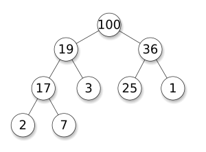

I have a [habit](https://github.com/antimatter15/ocrad.js) of writing blog posts in [Sublime Text](http://www.sublimetext.com/3) in lieu of legitimate READMEs. This [project](https://github.com/antimatter15/heapqueue.js) was simple and short enough that I think I did manage to write something with a passable semblance to a[ functional README](https://github.com/antimatter15/heapqueue.js/blob/master/README.md) before initiating this quest to craft a blog post.

This is hardly a project that I'd expect to go down in the annals of my blog as particularly interesting or notable. Instead, it's a rather boring low-level [computer sciencey thingy](http://en.wikipedia.org/wiki/Heap_(data_structure)) who would feel perfectly comfortable amidst homework assignments.

In fact, it's virtually assured that documenting this endeavor– the combination of writing the words which comprise this post and the documentation already written on how to use this rather simple library– will inevitably consume more of my time than actual coding (people who are more familiar with highly intricate professional software tapestries may claim that such is merely the ideal and typical experience of a programmer).

Notice that I've managed to spend three paragraphs (well, my paragraphs are on the order of two sentences, so it doesn't even qualify for the fourth-grade definition for what a paragraph is) talking about the uninteresting character of the project, its relative diminutive size, and the process of writing about the subject, without actually describing what exactly the project is. This, more than perhaps any other project of mine deserves such a diversion, for it is unlikely to yield[ "much amaze"](vQvAaGW.jpg) or even a modest ["such wow"](tumblr_mtsg23ehsy1sjf3who1_500.jpg).

It is a binary heap priority queue, a teensy bit shy of 50 lines, a mere kilobyte minified. It's very loosely based off of Adam Hooper's [js-priority-queue](https://github.com/adamhooper/js-priority-queue) but considerably smaller.

Now that I've gotten the actual informative and useful part of the blog post off my shoulders, I can take you along for the unproductive plunge into the rather lame backstory for the project. I was working on a port of the [Telea](http://iwi.eldoc.ub.rug.nl/FILES/root/2004/JGraphToolsTelea/2004JGraphToolsTelea.pdf) [inpainting](http://en.wikipedia.org/wiki/Inpainting) algorithm and needed a [priority queue](http://en.wikipedia.org/wiki/Priority_queue), because the little incremental[ insertion sort](http://en.wikipedia.org/wiki/Insertion_sort) that I hacked together in two lines was taking a few orders of magnitude longer than was acceptable.

With my considerable Google-Fu, I searched "javascript heap queue" and found [js-priority-queue](https://github.com/adamhooper/js-priority-queue) as well as [PriorityQueue.js](https://github.com/STRd6/priority_queue/tree/master). They both happened to be implemented in [CoffeeScript](http://coffeescript.org/), which [I love](https://github.com/neotenic/protobowl), except not really. I like the syntax, but creating a project using it usually involves setting up some compilation pipeline in order to get it to do the things that I want it to do. Overall, it's a bit too much of a hassle for little projects.

I couldn't actually find the source code for PriorityQueue.js so I settled for js-priority-queue. It was a bit annoying in that it required [require.js](http://requirejs.org/) to function and included several storage strategies that were totally useless. So I copied and pasted a few files together and stripped it of its [AMD](http://requirejs.org/docs/whyamd.html) dependencies and created a somewhat dieted version.

But as 9th grade World History teaches us, [appeasement](http://en.wikipedia.org/wiki/Appeasement) never works, and this purely pragmatic minification leads inexorably to an irrational [code golfing](http://en.wikipedia.org/wiki/Code_golf). At that point, I was overcome by this undeniable urge to cleanse it further, perhaps blinded by [not-invented-here syndrome](http://en.wikipedia.org/wiki/Not_invented_here) and software anorexia. Minutes later the file had been laid waste and in its place there existed its [bare skeletal remains](https://github.com/antimatter15/heapqueue.js/blob/master/heapqueue.js).

Now all I need to do is push it to [github](https://github.com/antimatter15/heapqueue.js) and write a blog post...
