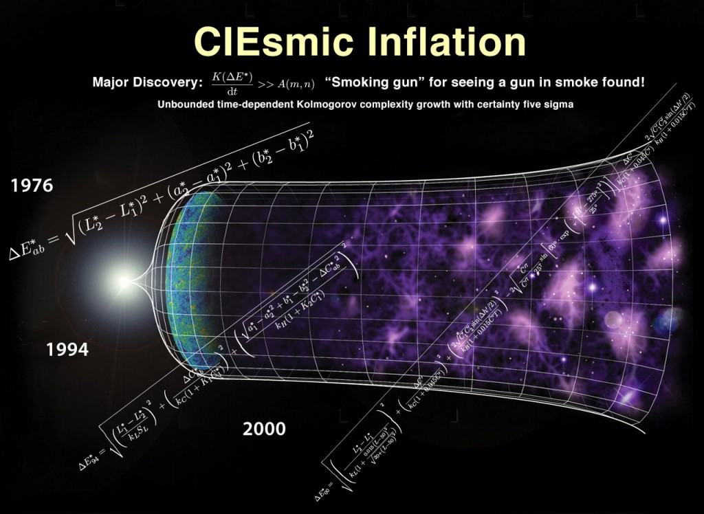
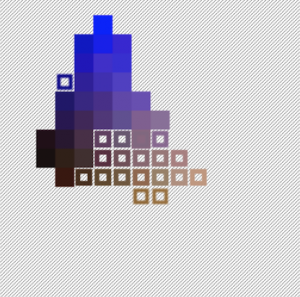

 I was doing some experiments with clustering colors, and it turns out that RGB euclidean distance is woefully inadequate, so here's a neat little visualization of the colors in an certain image (an obligatory cat) in L*a*b space (specifically the axes represent L* and a*).

So it turns out that comparing the difference between RGB colors is actually a really shitty way to determine color distance. There are colors which have similar RGB representations while being perceptually distant, and perceptually similar colors with vastly different representations.

So I decided to run a series of large scale double-blind (heh) experiments on human perception, analyzing the output with a dizzying array of statistical techniques and— oh wait, no I didn't, because scientists have gotten that all figured out since the late '70s.

That group of color scientists, the International Commission on Illumination (CIE, acronyms are a bit weird when [they're international](https://en.wikipedia.org/wiki/Coordinated_Universal_Time), and by international, I mean [French](https://en.wikipedia.org/wiki/International_System_of_Units)), have been working tirelessly since the early 20th century to create increasingly nuanced mathematical models of color perception.

Rather than[ give up and use tables](http://ajaxian.com/archives/css-and-tables-the-war-continues/giveupandusetables) (of a slightly different sort), they've elected to add increasingly nuanced corrections to the originally elegant euclidean distance metric. Somewhere on that trek, they've actually abandoned the notion of actually being a metric- the DeltaE function, which defines how to calculate the perceptual distance between any two colors, is actually only a quasimetric— that is, it isn't guaranteed that the distance from a point A to a point B is the same as the distance from point B to point A.

I originally wrote this blog post to be parody of all the buzz over the discover of evidence for Alan Guth's cosmic inflationary theory (hence the diagram), but I kind of waited a while for the content to ferment (albeit not the decades requisite to be worthy of a Nobel).

So here's a[ little library ](https://github.com/antimatter15/rgb-lab)for converting between L*a*b* and sRGB, as well as computing DeltaE. There's probably stuff like configuring the white point that I haven't adequately considered, but this was good enough for my purposes of filtering colors for Project Naptha.
