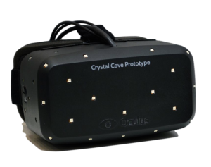

I'm almost certainly an outsider, so I can't speak for the gaming or VR communities, but to me the Facebook acquisition (and the [Abrash onboarding announcement](www.oculusvr.com/blog/introducing-michael-abrash-oculus-chief-scientist/)) signals that the new Oculus is more interested in bringing to fruition the Metaverse from [Snow Crash](https://en.wikipedia.org/wiki/Snow_Crash), and that the hardware (Rift DK1, Crystal Cove, DK2, etc.) has been reduced to a mere means to attaining that end.

I think the "original" product was always contextualized as a gaming accessory, as the vested (financial, by virtue of [Kickstarter](https://www.kickstarter.com/projects/1523379957/oculus-rift-step-into-the-game)) interest was held by gamers hoping to utilize this new form factor and experience.

I guess the question is what exactly is Oculus? In the beginning, I'd venture that the answer was simple. They were building a head mounted display which would be affordable, leveraging the technological improvements of the past decade (cheap high quality displays meant for phones and tablets, faster graphics cards). The hardware was their concern, and the software, the games and experiences, everyone else's.

From the [QuakeCon Abrash-Carmack-Luckey](https://www.youtube.com/watch?v=8gaqQdyfAz8) panel (which may be a bit dated), Carmack admits that he isn't really interested in developing the hardware, as opposed to Luckey whose passion really lies in developing that hardware. Carmack, Abrash, and ultimately Facebook are alike in that they are _software_ titans, which I think really shifts the balance in terms of the intentions for Oculus.

Sure there's the hardware aspect, which is far from a solved problem. But given the palpable progress of Crystal Cove and the famed Valve prototypes, the end is nigh (to be less melodramatic, the consumer edition is on the brink of happening). But if you look at the teardowns, it's a tablet screen, LEEP optics, an inertial measurement unit, and infrared tracker. The underlying display technology isn't going to get better, because it's already piggybacking off a much larger market where even Facebook's considerable budget is a drop in the bucket.

I think since Carmack joined Luckey's shop, the destiny of Oculus has shifted from producers of a mere display commodity to a more vertically integrated entity which develops both the hardware and the software which drives its progress and adoption (a la Apple).

And that accumulation of software talent is, I think, itself, a credible threat to the game developers hoping to build games for the Rift- because it establishes a first party, and that has the risk of pushing third party developers into the realm of the second class citizen.

But this dynamic of conflicted interest has played out several times before, and it is not usually an _existential_ risk to the third parties. With transitions flipped, Microsoft had to deal with the risk of alienating OEMs when it started developing its own hardware- the Surface tablet. Likewise, Google's decision to develop Nexus tablets and phones (and the acquisition of Motorola Mobility) was criticized because it would inevitably result in favoritism for its own devices, weakening relationships between LG, HTC, Samsung and the ilk.

The risk in stifling competition is inherent in any kind of move involving integration (horizontal, vertical, or 37 degrees counterclockwise), but on the other hand, this dissolution of the separation of interests enables the unimpeded progress toward a coherent vision.

And I think that coherent vision is to construct Virtual Reality that is truly grand, world-encompassing and liable to all the philosophical depth missing from prior incarnations outside of science fiction. Not the kind of gimmicky interactions retrofitted into first person shooters, jumping onto the bandwagon represented by that euphemistic initialism "VR".

I don't think post-acquisition institutional independence or agency ultimately matter, because the seeds for something larger has already been sown.

Is this new Oculus a threat to existing companies and their efforts to build VR games? Perhaps, this has to be true on some level, the more interesting question, I think, is whether or not this cost will be offset (and then some) by those inspired by Oculus's vision and audacity and that which can be built on this new and boundless meta-platform.

* * *

<small>
..so I just finished writing all of this. I originally meant it as a Hacker News comment, and then halfway through I decided not to ultimately submit it, because if you really think about it, this is all kind of silly. I feel like one of those poor conspiracy theorists connecting dots where the lines may not exist. I'm sure there are nontrivial technical challenges that still need to be vanquished, but as an outside observer, I'd claim that Dunning-Kruger permeates my perception, and I can't possibly gauge the extent of problems that remain (the less you know, the simpler it all seems). And I have a habit of conflating long term with short term (when I was 12, I vowed not to learn to drive, because surely, aeons from then, when I turned 16, the cars would no doubt drive themselves). </small><small>I mean, I wrote all of this like five minutes ago, it can't be _that _wrong already, right?</small>
