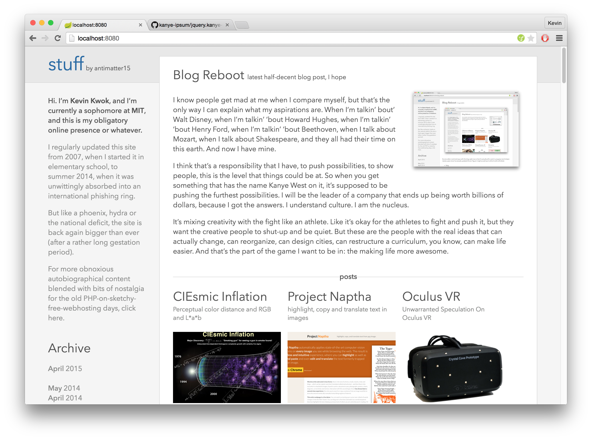
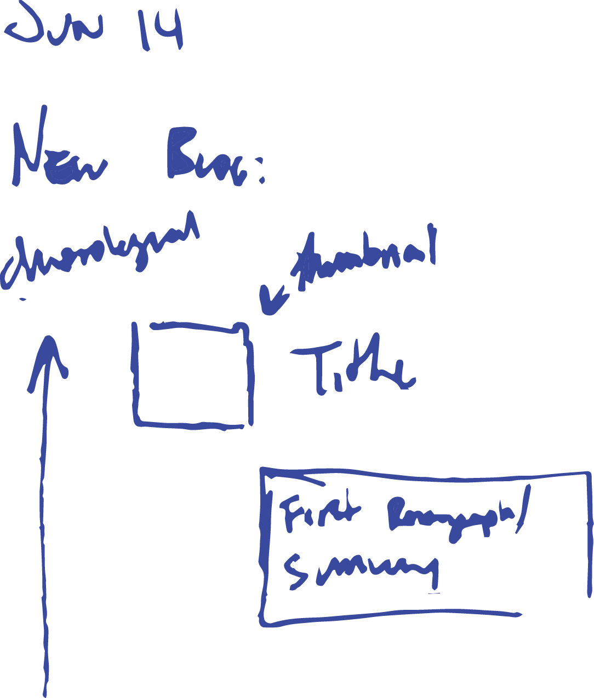
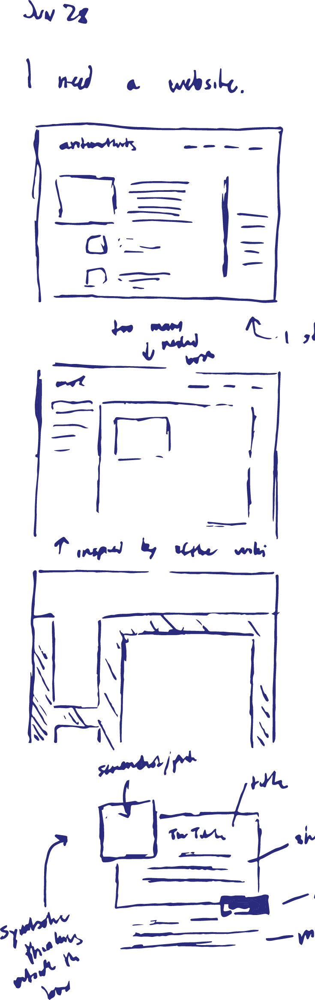

This is my submission to blogdom's burgeoning class of eternally "work in progress" sites. I've been working on this blog reboot for nearly a year at this point (rest assured, I haven't worked on it for any appreciable fraction of that time— but it's nonetheless traumatizing for me as "blog posts written" is my primary metric for personal productivity). 

There's still a lot left to be done, but right now it should be in a more or less functional and navigable state. I've just added image thumbnailing (so this homepage shouldn't take a triassic aeon to load anymore), which seems like an addition substantial-enough to warrant some new words adorning the featured post callout.

Most importantly though, it's now a hip static site hosted on Github Pages (though I might move to S3), so the Turkish phishers last remaining venue for hijacking this site may be sending a pull request. 

### Getting Hacked

### First Sketches

I guess it makes a reasonable amount of sense to write about how this site works. This is the first incarnation of the blog which is to any appreciable extent aesthetically original. It isn't the default theme of JupiterCMS, PHPFusion, nor is it a free template for Wordpress. 

It's a pretty simple design, and it's pretty nifty that in this day and age, a design which is sparse by ignorance is indestinguishable from a good design which is sparse by (uh) design. There isn't much besides the simple arrangement of rectangles and lines and it relies pretty heavily on typography and whitespace to delimit sections. 

At around the same time my blog stopped working, I came into the posession of a Moleskine. On June 14th, apparently, I started my first sketch of what my blog might be like. 

In retrospect, it didn't really look very coherent and I have literally no idea what I was trying to do at the time. But one of the motivations behind the entire endeavor was to strike a sort of balance between a blog and a portfolio. I like the idea of documenting the process of things and writing some part of the though process a somewhat non-abbreviated form. But one thing that I noticed is that a blog is a terrible means of surfacing older content, and I think a lot of the interesting ideas I've explored are the ones which I played around with several years ago. 

On the other spectrum, I didn't want to go too far in the direction of summary. I didn't quite want it to be simply a résumé where I condense every endeavor into two buzzword-packed sentences which summarize the little iota of cleverness imbued in the project. 

And so the motivation of the design was finding some way to hybridize the two goals— summary and process. 

I found another sketch in my Moleskine dated June 24th, which seems to be a bit more coherent. On the right you can see some blocks and lines which, while not having much bearing on the current site design, at least seem like they might pass a Turing test criterion for sufficiently-websiteish website.

One thing that I noticed is that the sequence of my projects tends to be pretty structured. Over the years, I tend to explore little ideas which tend to culminate into singular projects— or alternatively, I build a larger project and spin off smaller components. All of this tends to happen over a relatively short time period (a few months to a year). 

So in terms of a projects list, this means that I can introduce a bit of an aesthetic cadence where a series of minor projects are occasionally punctuated by larger projects. And because of this natural faux-hierarchy there's a natural clustering which is generally both temporal and subjective. The short projects have single-sentence summaries, whereas the larger projects can have a paragraph worth of elaboration.

Naturally, all the project descriptions are hyperlinked and lead to a project page which includes all the blog posts documenting the process of creating that particular project. 

