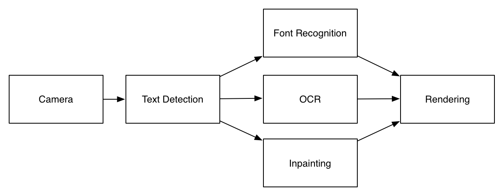
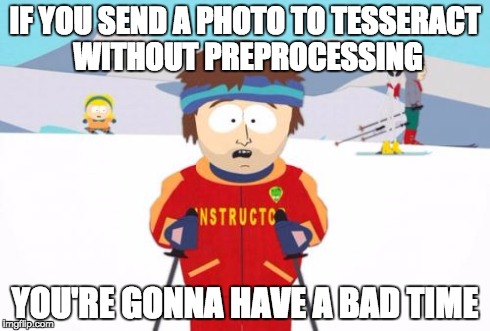
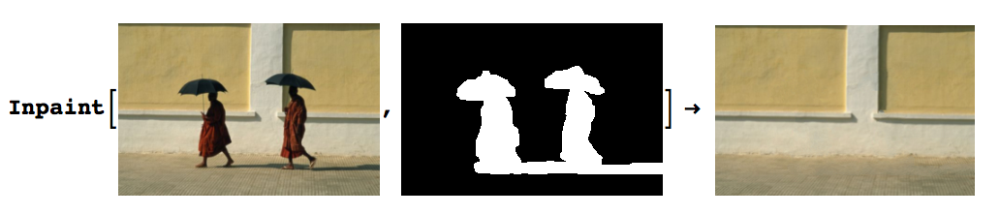

Word Lens was launched nearly [5 years ago](http://en.wikipedia.org/wiki/Word_Lens), but it still feels like a relic borrowed from the distant future. It understandably took the world by storm, and a few years later it was acquired by Google and folded into the [Google Translate app](http://googleblog.blogspot.com/2015/01/hallo-hola-ola-more-powerful-translate.html). 

Word Lens was an augmented reality translation app— it showed you the world as if through a camera viewfinder but miraculously substituted words written in another language with words written in your native tongue, all in the original font, orientation and color. 

At least for me, the instinctive reaction to witnessing a magic trick is to peer beneath the veneer and guess at the mechanics of it. It probably looks something like this:

The idea is pretty simple, we take an image from the camera, we figure out where the text is (text detection), we recognize that text (OCR), we figure out the geometry, font and color of the text (font recognition), we erase that text from the image (inpainting), and then finally we render the final result together.

Half a decade ago— three full cycles of [Moore's law](http://en.wikipedia.org/wiki/Moore%27s_law)— meant processors back were pretty underpowered compared to mobile processors today. I'm sure developers at Word Lens went through great pains to make it reasonably performant, which probably explains why they used custom solutions for OCR, text detection and inpainting. 

But these days, almost every piece of this block diagram is built into OpenCV. Which is how an intractable feat of engineering gets replicated with only about a hundred lines of code.

### Installing OpenCV 3.0 rc1 & opencv_contrib

OpenCV 3.0 isn't technically stable yet, so the version that you'll readily find in your package manager probably won't be new enough. At time of writing, the latest packaged version is [OpenCV 3.0 Release Candidate 1](http://opencv.org/opencv-3-0-rc1.html).
	

	wget "https://github.com/Itseez/opencv/archive/3.0.0-rc1.zip"
	unzip 3.0.0-rc1.zip
	cd opencv-3.0.0-rc1/

The text detection module isn't considered a core module, so we have to get opencv_contrib as well. I placed it in the `opencv-3.0.0-rc1` directory, but it doesn't really matter. 

	git clone https://github.com/Itseez/opencv_contrib.git

Now to actually build it, we need to create a build directory and run `cmake`

	mkdir build
	cd build
	cmake -DOPENCV_EXTRA_MODULES_PATH=../opencv_contrib/modules ../
	make -j5
	sudo make install

### Scene Text Detection

If you've ever tried to pipe a photo straight from a camera into Tesseract, you've probably seen  that the output is typically gibberish. Tesseract is pretty sensitive to noise and rotation and generally demands something binarized with a simple columnar layout. 

[Project Naptha](/project/project-naptha/) uses the Stroke Width Transform, connected components and a number of heuristics to figure out reasonable clusters of text. 

OpenCV 3.0 has had a scene text detection algorithm described by [Neumann L., Matas J.](http://cmp.felk.cvut.cz/~neumalu1/neumann-cvpr2012.pdf) (CVPR 2012) since [July 2013](https://github.com/Itseez/opencv/commit/5abe3b59f5308a84dc3bd2c8b543b3972871278f). 

> The scene text detection algorithm described below has been initially proposed by Lukás Neumann & Jiri Matas [Neumann12]. The main idea behind Class-specific Extremal Regions is similar to the MSER in that suitable Extremal Regions (ERs) are selected from the whole component tree of the image. However, this technique differs from MSER in that selection of suitable ERs is done by a sequential classifier trained for character detection, i.e. dropping the stability requirement of MSERs and selecting class-specific (not necessarily stable) regions.

	// Create ERFilter objects with the 1st and 2nd stage default classifiers
	// since er algorithm is not reentrant we need one filter for channel
	cout << "Loading text detector..." << endl;
	vector< Ptr<ERFilter> > er_filters1;
	vector< Ptr<ERFilter> > er_filters2;
	for (int i=0; i<2; i++) {
	    Ptr<ERFilter> er_filter1 = createERFilterNM1(loadClassifierNM1("erfilter/trained_classifierNM1.xml"),8,0.00015f,0.13f,0.2f,true,0.1f);
	    Ptr<ERFilter> er_filter2 = createERFilterNM2(loadClassifierNM2("erfilter/trained_classifierNM2.xml"),0.5);
	    er_filters1.push_back(er_filter1);
	    er_filters2.push_back(er_filter2);
	}

### Text Recognition

Then we'll initialize the OCR engines:

	cout << "Initializing OCR engines ..." << endl;
    int num_ocrs = 10;
    vector< Ptr<OCRTesseract> > ocrs;
    for (int o=0; o<num_ocrs; o++) ocrs.push_back(OCRTesseract::create());

Something with the images and channels

	// Run the text detection twice
	// one with the regular grayscale image, for detecting light features on a dark background
	// and the image with colors negated, for detecting dark letters on a light background
	vector<Mat> channels;
    vector<vector<ERStat> > regions(2); //two channels
    Mat grey;
    cvtColor(image,grey,COLOR_RGB2GRAY);
    channels.clear();
    channels.push_back(grey);
    channels.push_back(255-grey);

### Inpainting

### Font Recognition

